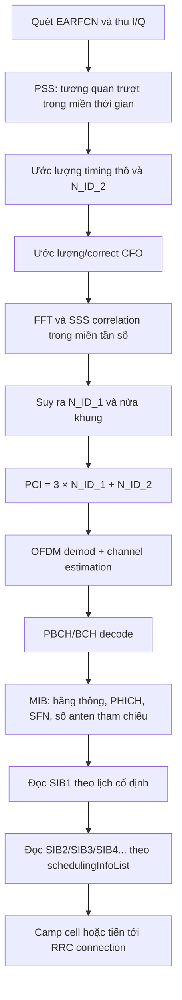
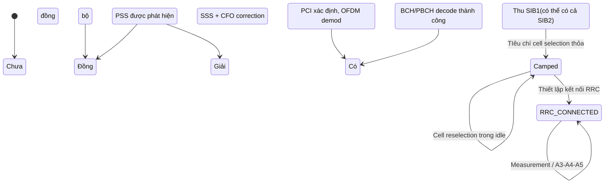
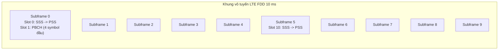

# Cell Search trong LTE

Trong LTE, **Cell Search** là chuỗi thủ tục mà UE dùng để tìm thấy một cell, đồng bộ thời gian và tần số với cell đó, xác định **Physical Cell Identity** (PCI), giải mã **PBCH/BCH** để lấy **MIB**, rồi tiếp tục thu **SIB1** và các **SIB** liên quan để có thể **camp** lên cell trong RRC_IDLE hoặc tiến tới thiết lập kết nối RRC. Chuẩn 3GPP quy định rất chặt chẽ cấu trúc tín hiệu, vị trí thời gian–tần số, nội dung bản tin quảng bá và các tiêu chí đo lường; tuy nhiên, chuẩn **không áp đặt một thuật toán thu duy nhất**, nên các bộ thu thực tế thường dùng các kỹ thuật tương quan, ước lượng lệch tần số và đồng bộ OFDM “điển hình” nhưng không phải là phần bắt buộc theo kiểu một thuật toán chuẩn hóa duy nhất.

Về bản chất, chuỗi thao tác đi từ PHY đến RRC có thể tóm gọn như sau: UE quét tần số/EARFCN, phát hiện **PSS** để lấy đồng bộ thô và \(N_{ID}^{(2)}\), dùng **SSS** để suy ra \(N_{ID}^{(1)}\) và xác định khung/half-frame, từ đó suy ra **PCI** theo công thức \(N_{ID}^{cell}=3N_{ID}^{(1)}+N_{ID}^{(2)}\). Sau đó UE giải mã **PBCH** để lấy **MIB** gồm băng thông đường xuống, cấu hình PHICH, và các bit của SFN; tiếp theo UE dùng lịch trong **SIB1** để biết khi nào thu các SI message khác, trong đó **SIB2** và **SIB3** đặc biệt quan trọng cho truy nhập vô tuyến và cell selection/reselection. 

Đối với đo lường và mobility, LTE tiêu chuẩn hóa rõ **RSRP** và **RSRQ** ở lớp vật lý, còn **RS-SINR** là một đại lượng đo bổ trợ được chuẩn hóa ở lớp L1 nhưng không phải là tiêu chí camp-on cơ bản như RSRP/RSRQ. Ở **RRC_IDLE**, UE áp dụng các công thức chuẩn hóa \(S_{rxlev}\) và \(S_{qual}\) để quyết định cell có “suitable” hay không; trong **RRC_CONNECTED**, UE được cấu hình báo cáo đo theo các event như **A3/A4/A5**, có **offset**, **hysteresis** và **time-to-trigger** để tránh ping-pong và ổn định handover. 

## Khái niệm nền tảng và mục tiêu của Cell Search

Cần phân biệt rõ **Cell Search** với **Cell Selection**. Cell Search là phần phía trước của bộ thu: tìm tín hiệu đồng bộ, khóa thời gian/tần số, tìm PCI, giải mã PBCH/MIB và thu được đủ thông tin hệ thống ban đầu. Cell Selection là thủ tục mức UE ở idle mode lựa chọn cell phù hợp để camp, trên cơ sở PLMN, cell barred/not barred và điều kiện chất lượng/độ mạnh tín hiệu theo tiêu chí chuẩn hóa. Nói cách khác, Cell Search trả lời câu hỏi **“đây là cell nào và tôi đã đồng bộ được chưa?”**, còn Cell Selection trả lời câu hỏi **“tôi có nên camp lên cell này không?”**. 

Trong TS 36.304, UE ở idle mode dùng một trong hai thủ tục chọn ô là **Initial Cell Selection** hoặc **Stored Information Cell Selection**. Một cell “acceptable” cho limited service phải ít nhất không bị barred và phải thỏa cell selection criterion; còn một cell “suitable” cho normal service phải, ngoài việc thỏa các tiêu chí trên, còn thuộc PLMN phù hợp với đăng ký/chọn lựa của UE. Đây là điểm rất quan trọng: việc bắt được PCI và giải được MIB **chưa đủ** để camp lên cell; UE còn phải qua bước đánh giá suitability ở lớp thủ tục idle mode.

Mục tiêu kỹ thuật của Cell Search trong LTE gồm bốn phần liên tiếp: đồng bộ thời gian thô, bù lệch tần số đủ để làm việc OFDM ổn định, nhận dạng cell vật lý, và thu thông tin hệ thống quảng bá tối thiểu để đi tiếp lên RRC. Thiết kế PSS–SSS–PBCH được cố ý đặt trên vùng tần số trung tâm để cho phép UE dò tìm ngay cả khi chưa biết băng thông hệ thống thật của cell; sau khi giải mã MIB, UE mới biết **NDLRB** và có thể chuyển sang xử lý toàn băng cho PDCCH/PDSCH/SIB. 

## Quy trình từ PHY đến RRC

Sơ đồ dưới đây tóm tắt một chuỗi xử lý điển hình, tương thích với những gì 3GPP quy định về tín hiệu/lịch phát và với cách các bộ thu thực tế thường triển khai trong ví dụ tham chiếu của MathWorks.

Nếu viết thành chuỗi xử lý chi tiết từ lớp vật lý lên RRC, có thể xem nó như một “pipeline” gồm các bước sau: đầu tiên UE quét tần số và cố gắng phát hiện các tín hiệu đồng bộ ở vùng trung tâm phổ. Vì **PSS/SSS chỉ chiếm sáu resource block trung tâm**, việc tìm kiếm ban đầu có thể làm trên băng hẹp hơn toàn hệ thống; ví dụ MathWorks minh họa một luồng thu resample xuống **1.92 Msps** để phục vụ cell search/MIB decode trước khi biết băng thông thật. Sau khi PSS/SSS đã cho phép xác định cell và timing thô, UE thực hiện bù lệch tần số, OFDM demodulate, ước lượng kênh, rồi tiến hành giải PBCH. Khi MIB cho biết **NDLRB**, bộ thu có thể quay lại xử lý đúng tốc độ lấy mẫu danh định của băng thông đó để giải tiếp CFI/PDCCH/PDSCH và các SIB.

Về phía RRC, điểm mốc đầu tiên là **SIB1**. TS 36.331 quy định SIB1 có lịch cố định với chu kỳ 80 ms; lần phát đầu tiên ở **subframe 5** của các radio frame có **SFN mod 8 = 0**, và các lần lặp ở subframe 5 của các frame chẵn còn lại có **SFN mod 2 = 0**. Sau khi có SIB1, UE biết lịch các SI message khác qua **schedulingInfoList**, trong đó **SIB2 luôn có mặt trong SI message đầu tiên** của danh sách này. Vì vậy, từ góc nhìn hệ thống, Cell Search không kết thúc ở PCI hay MIB; nó chỉ thực sự hoàn tất khi UE đã có đủ SI ban đầu để đánh giá cell selection và/hoặc truy nhập RRC.

Sơ đồ trạng thái dưới đây cho thấy quan hệ giữa Cell Search, camping và mobility ở mức thủ tục UE. Các transition idle/reselection và measurement/handover trong connected sử dụng các tiêu chí khác nhau, dù đều bắt đầu từ việc PHY đã hoàn thành Cell Search cơ bản.

## Tín hiệu, tham số và quan hệ thời gian

TS 36.211 định nghĩa LTE dùng đơn vị thời gian cơ sở \(T_s = 1/(15000 \times 2048)\) giây. Một **radio frame** dài **10 ms**, gồm **10 subframe** mỗi subframe **1 ms**; với \(\Delta f = 15\) kHz, mỗi subframe gồm **2 slot**, mỗi slot **0.5 ms**. Đây là nền tảng để hiểu toàn bộ quan hệ thời gian của PSS, SSS và PBCH. Nếu muốn đối chiếu trực quan với sơ đồ chuẩn, có thể xem **Figure 4.1-1** của TS 36.211 về frame structure type 1, cùng mục **6.6.4** về PBCH mapping trong chính tiêu chuẩn này.

Trong **FDD** (frame structure type 1), **PSS** được ánh xạ vào **OFDM symbol cuối cùng của slot 0 và slot 10**, còn **SSS** nằm **ngay trước PSS một OFDM symbol** trong cùng các slot đó. Trong **TDD** (frame structure type 2), **PSS** nằm ở **OFDM symbol thứ ba của subframe 1 và 6**, còn **SSS** nằm ở **OFDM symbol cuối cùng của slot 1 và 11**, tức là sớm hơn PSS ba symbol OFDM. Điều này giải thích vì sao một bộ thu thực tế thường phải thử nhiều giả thuyết FDD/TDD và CP nếu chưa có prior knowledge.

Về miền tần số, **PSS** là chuỗi **Zadoff–Chu** với **3 root index** tương ứng ba giá trị \(N_{ID}^{(2)}\in\{0,1,2\}\), nhưng khi ánh xạ lên resource grid thì chỉ dùng **62 subcarrier** quanh DC, tương đương sáu resource block trung tâm với DC bỏ trống. **SSS** cũng dài **62 phần tử**, được tạo bởi ghép xen hai chuỗi nhị phân dài 31 và được xáo trộn theo \(N_{ID}^{(2)}\); SSS cho phép suy ra \(N_{ID}^{(1)}\) và đồng thời phân biệt timing giữa các nửa khung. **PBCH** dùng **QPSK**, nằm ở **slot 1 của subframe 0**, trên **72 subcarrier trung tâm** trong **4 OFDM symbol đầu** của slot này, và nội dung BCH được truyền qua **4 radio frame liên tiếp**, tương ứng TTI 40 ms của BCH. 

Bảng sau tổng hợp các tín hiệu và khối thông tin quan trọng nhất trong Cell Search LTE.

| Đối tượng | Vai trò chính | Vị trí/thời lượng cốt lõi | UE lấy được gì | Bước xử lý đầu tiên điển hình |
|---|---|---|---|---|
| **PSS** | Đồng bộ thô và tìm \(N_{ID}^{(2)}\) | 62 subcarrier quanh DC; FDD: symbol cuối slot 0 và 10; TDD: symbol thứ ba subframe 1 và 6 | Timing thô, 1 trong 3 identity trong nhóm | Tương quan trượt miền thời gian |
| **SSS** | Suy ra \(N_{ID}^{(1)}\), frame/half-frame timing | 62 phần tử từ hai chuỗi dài 31; FDD: ngay trước PSS; TDD: ở slot 1 và 11, sớm hơn PSS ba symbol | Nhóm cell ID, phân biệt nửa khung | FFT rồi correlation miền tần số |
| **PCI** | Nhận dạng cell vật lý | Không phải tín hiệu riêng; \(N_{ID}^{cell}=3N_{ID}^{(1)}+N_{ID}^{(2)}\), miền giá trị 0…503 | PhysCellId để đo lường, báo cáo, HO, re-establishment | Kết hợp kết quả PSS và SSS |
| **PBCH/BCH** | Mang thông tin quảng bá tối thiểu | Slot 1, subframe 0; 72 subcarrier trung tâm; 4 OFDM symbol đầu; BCH TTI 40 ms | Bản tin BCH đã mã hóa, số anten tham chiếu qua CRC mask | OFDM demod, channel estimate, PBCH decode |
| **MIB** | Cấu hình hệ thống tối thiểu | Có trong BCH/PBCH; trong R15 ASN.1 gồm dl-Bandwidth, phich-Config, systemFrameNumber và các trường BR bổ sung | NDLRB, PHICH, 8 MSB của SFN; 2 LSB của SFN suy ra từ timing PBCH | Parse MIB sau PBCH decode |
| **SIB1** | Cho biết cell access và lịch SI khác | Chu kỳ 80 ms; phát đầu ở subframe 5 khi SFN mod 8 = 0; lặp ở subframe 5 của các frame chẵn | PLMN, TAC, CellIdentity, cellBarred, q-RxLevMin, schedulingInfoList, si-WindowLength | PDCCH blind search + PDSCH/DL-SCH decode |
| **SIB2** | Cấu hình vô tuyến chung cho mọi UE | Nằm trong SI message đầu tiên của schedulingInfoList | ac-barring, radioResourceConfigCommon, UE timers/constants, freqInfo, timeAlignmentTimerCommon | Theo lịch SI sau khi có SIB1 |
| **SIB3/SIB4** | Reselection intra-frequency và láng giềng/blacklist | Theo lịch SI từ SIB1 | q-Hyst, threshServingLow, cellReselectionPriority, s-IntraSearch, t-ReselectionEUTRA; intraFreqNeighCellList, intraFreqBlackCellList | Đọc khi cần công thức reselection hoàn chỉnh |

Một quan hệ thời gian rất quan trọng nhưng thường bị bỏ sót là: trong **FDD**, sau cặp **SSS→PSS** ở cuối **slot 0** của **subframe 0**, **PBCH** xuất hiện **ngay trong slot kế tiếp** của cùng subframe; còn cặp **SSS→PSS** ở **subframe 5** thì **không** đi kèm PBCH gần như lập tức. Vì vậy, bộ thu có thể dùng tổ hợp SSS, timing và PBCH để khóa chính xác frame timing thay vì chỉ dừng ở mức 5 ms. Đồng thời, vì PBCH trải trên 40 ms còn SIB1 theo chu kỳ 80 ms với các repetition trên frame chẵn, độ trễ tìm cell hoàn chỉnh trong thực tế không chỉ phụ thuộc bước tương quan PSS/SSS mà còn phụ thuộc “thời điểm UE rơi vào lịch phát” của PBCH và SIB1. 

Để hình dung timing một cách cô đọng cho LTE FDD, có thể xem lược đồ sau. Những ô còn lại trong frame chủ yếu mang control/data/reference signals, nhưng **cell search** ban đầu chỉ cần tập trung vào các vị trí được đánh dấu. 

## Thuật toán phát hiện, tương quan, đồng bộ và suy diễn PCI

Từ góc độ nghiêm ngặt của tiêu chuẩn, TS 36.211/36.212/36.331 mô tả **cấu trúc tín hiệu, mã hóa, ánh xạ, lịch phát, nội dung bản tin và điều kiện đo lường**; còn thuật toán bộ thu cụ thể là vấn đề triển khai. Vì vậy, những gì sau đây nên được hiểu là **thuật toán điển hình, phù hợp với cấu trúc chuẩn**, chứ không phải “một thuật toán bắt buộc duy nhất” của 3GPP. Ví dụ tham chiếu của MathWorks cho LTE thu trực tiếp nêu rất rõ: PSS được dò bằng **time-domain correlation**, SSS bằng **frequency-domain correlation**, CFO bằng **cyclic-prefix correlation**, rồi mới tới PBCH/MIB/SIB1 recovery. 

Một bộ thu điển hình bắt đầu bằng **matched filtering** hay tương quan trượt với ba ứng viên PSS thời gian tương ứng ba root index \(u=\{25,29,34\}\). Về mặt biểu diễn, có thể viết một metric chuẩn kiểu
\[
C_u[\tau] = \left|\sum_n r[n+\tau]\,s_u^*[n]\right|^2,
\]
trong đó \(r[n]\) là mẫu thu và \(s_u[n]\) là bản sao PSS cục bộ sau OFDM modulation về miền thời gian. Khi \(C_u[\tau]\) đạt đỉnh, UE có được **timing thô** và ứng viên \(N_{ID}^{(2)}\). Việc PSS dùng Zadoff–Chu là cực kỳ thuận lợi vì tương quan tự động của chuỗi ZC lý tưởng rất “nhọn” tại độ trễ đúng, giúp định vị chính xác symbol timing. Trong thực tế, time-domain PSS detection chịu được **lệch tần số nhỏ**, nhưng lệch tần số lớn sẽ làm đỉnh tương quan giảm. 

Sau khi có timing thô, bộ thu thực hiện **ước lượng lệch tần số mang**. Một kỹ thuật OFDM kinh điển là dùng **tương quan giữa cyclic prefix và phần cuối ký hiệu OFDM**. Ví dụ MathWorks nêu rõ lệch tần số được ước lượng bằng CP correlation và miền không mơ hồ của bước ước lượng này xấp xỉ **\(\pm 7.5\) kHz**, tức **\(\pm\) nửa khoảng cách sóng mang con 15 kHz**. Sau khi bù CFO, SSS mới được đưa ra FFT và so khớp trong miền tần số; bước này tận dụng việc UE đã biết \(N_{ID}^{(2)}\) từ PSS nên không còn phải thử toàn bộ 504 PCI nữa, mà chủ yếu chỉ còn không gian giả thuyết \(N_{ID}^{(1)}\) cùng giả thuyết về half-frame/frame structure. Đây chính là ý tưởng thiết kế “chia cell ID thành 168 nhóm × 3 phần tử” để giảm độ phức tạp tìm kiếm. 

Với SSS, bộ thu thường lập một metric tương quan tần số kiểu
\[
C_v = \left|\sum_k R[k]\,S_v^*[k]\right|,
\]
với \(R[k]\) là vector tần số của symbol SSS đã cân pha/đồng bộ tương đối và \(S_v[k]\) là một ứng viên SSS cục bộ trong tập 168 nhóm cell ID và hai khả năng timing. Ứng viên tốt nhất cho ra \(N_{ID}^{(1)}\), và khi kết hợp với PSS ta có
\[
N_{ID}^{cell}=3N_{ID}^{(1)}+N_{ID}^{(2)}.
\]
Đây cũng là giá trị **PhysCellId** mà RRC dùng trong các cấu hình đo lường, danh sách láng giềng, re-establishment và các bản tin khác; IE **PhysCellId** trong TS 36.331 có miền giá trị **0..503**. 

Nếu **duplex mode** hay **cyclic prefix** chưa biết từ trước, một triển khai thực tế có thể thử lần lượt các cặp giả thuyết **FDD/TDD** và **Normal/Extended CP**, rồi chọn cặp nào cho **đỉnh tương quan mạnh nhất**. Đây chính là điều ví dụ tham chiếu MathWorks thực hiện: lặp cell search trên từng tổ hợp duplex mode và CP, rồi lấy cấu hình có peak lớn nhất. Cùng ví dụ đó cũng minh họa một heuristic hậu kiểm là so sánh đỉnh tương quan của cell đã chọn với các ứng viên PSS còn lại; ngưỡng “1.3 × max(other peaks)” chỉ là **heuristic kinh nghiệm**, không phải quy tắc chuẩn hóa của 3GPP. 

Sau khi PCI và timing cơ bản đã có, bộ thu đi tới **PBCH**. Theo TS 36.212, BCH có **transport block 24 bit**, gắn **CRC 16 bit**, rồi **tail-biting convolutional coding** và **rate matching**; theo TS 36.211, PBCH dùng **QPSK** và ánh xạ trên core set RE của slot 1/subframe 0. Một chi tiết rất quan trọng cho triển khai là **CRC của PBCH được mask theo số antenna port phát** tại eNodeB, với các trường hợp chuẩn hóa là **1, 2 hoặc 4 antenna ports**. Do đó, một bộ thu thực tế thường phải thử các giả thuyết port phù hợp trong lúc giải PBCH; ví dụ MathWorks cho thấy từ hàm giải PBCH có thể thu được đồng thời **mib**, **nfmod4** và **CellRefP**. 

TS 36.331 quy định trong **MIB** có trường **systemFrameNumber** cỡ **8 bit**, và **2 bit thấp nhất của SFN** không nằm trực tiếp trong trường này mà được “suy ra ngầm” từ vị trí thời gian trong **40 ms PBCH TTI**. Vì vậy công thức phục hồi SFN toàn phần là:
\[
SFN = 4 \times SFN_{\text{MIB,8MSB}} + nfmod4.
\]
Đây là lý do vì sao giải PBCH không chỉ là giải “nội dung MIB”, mà còn là bước hoàn tất đồng bộ khung modulo 4 frame. Trong ví dụ MathWorks, bộ thu dùng đúng logic này: sau khi parse MIB, UE cộng thêm **nfmod4** để suy ra **NFrame** hoàn chỉnh. 

Khi đã có MIB, UE biết **NDLRB** nên có thể chuyển sang OFDM demod cùng tốc độ lấy mẫu đúng băng thông cell. Từ đây, các bước tiếp theo là **channel estimation**, **PCFICH/CFI decode**, **PDCCH blind search**, tìm các DCI có CRC mask bởi **SI-RNTI**, rồi giải **PDSCH/DL-SCH** để lấy **SIB1** và các SI message tiếp theo. Đây là chỗ giao giữa PHY và RRC: PHY mang về bit-stream và chỉ số đo lường, còn RRC dùng chúng để xây dựng ngữ cảnh hệ thống, lịch SIB và cấu hình mobility. 

## Đo lường, lựa chọn ô và hàm ý handover

Trong LTE, hai đại lượng đo cơ bản nhất là **RSRP** và **RSRQ**. TS 36.214 định nghĩa **RSRP** là **trung bình tuyến tính** của công suất trên các resource element mang **cell-specific reference signal** trong băng đo xét; tham chiếu đo là tại **antenna connector của UE**, và chuẩn cho phép UE có tự do triển khai nhất định về số lượng RE và độ dài cửa sổ đo miễn đáp ứng yêu cầu độ chính xác. **RSRQ** được định nghĩa là
\[
RSRQ = \frac{N \times RSRP}{RSSI},
\]
trong đó \(N\) là số RB của băng đo RSSI, còn RSSI gồm tổng công suất thu từ mọi nguồn trong băng đo. Điều này làm RSRQ nhạy với nhiễu và tải cell hơn RSRP. **RS-SINR** cũng được TS 36.214 định nghĩa là tỷ số giữa công suất trên RE của CRS và công suất nhiễu/can nhiễu trên cùng miền đo, nhưng về mặt mobility LTE cổ điển, RSRP/RSRQ vẫn là hai đại lượng cốt lõi của selection/reselection/reporting. 

Trong **RRC_IDLE**, criteria chọn cell được TS 36.304 viết dưới dạng
\[
S_{rxlev}=Q_{rxlevmeas}-(Q_{rxlevmin}+Q_{rxlevminoffset})-P_{compensation}-Q_{offsettemp}
\]
và
\[
S_{qual}=Q_{qualmeas}-(Q_{qualmin}+Q_{qualminoffset})-Q_{offsettemp}.
\]
Ở chế độ normal coverage, cell selection criterion chuẩn là **\(S_{rxlev}>0\)** và, nếu xét điều kiện chất lượng, **\(S_{qual}>0\)**. Trong đó \(Q_{rxlevmeas}\) là đo **RSRP**, còn \(Q_{qualmeas}\) là đo **RSRQ**. TS 36.331 quy định các ngưỡng broadcast như **q-RxLevMin** trong SIB1 và các tham số reselection quan trọng như **q-Hyst**, **threshServingLow**, **cellReselectionPriority**, **s-IntraSearch**, **t-ReselectionEUTRA** trong SIB3; nếu các trường chất lượng như **q-QualMin** không được phát, UE mặc định xem ngưỡng chất lượng là âm vô cùng, tức logic camp-on trên thực tế nghiêng về RSRP hơn. 

SIB4 cung cấp thông tin láng giềng **intra-frequency** và **blacklisted cells**, nghĩa là sau khi UE đã camp, cơ chế reselection không chỉ dựa vào ngưỡng broadcast chung mà còn có thể áp thêm **q-OffsetCell** cho từng láng giềng hoặc loại trừ một dải PCI khỏi cân nhắc. Đây là cầu nối giữa Cell Search ở PHY và reselection ở RRC/idle mode: PHY phải phát hiện được một láng giềng trước, nhưng RRC mới quyết định láng giềng đó có nên được đánh giá hay bỏ qua không. 

Trong **RRC_CONNECTED**, UE không tự “camp” theo nghĩa idle nữa mà đo và báo cáo. TS 36.331 mô tả các event mobility như **A1, A2, A3, A4, A5** trong **ReportConfigEUTRA**. Với **Event A3**, điều kiện kích hoạt vào/ra được viết thành các bất đẳng thức so sánh cell lân cận với PCell/PSCell, có tính đến **offset tần số**, **cell-specific offset**, **A3 offset** và **hysteresis**; trường **a3-Offset** có bước thực **0.5 dB**, còn IE **Hysteresis** có miền **0..30** tương ứng giá trị thực **field × 0.5 dB**. Ngoài ra, còn có **timeToTrigger** với các giá trị chuẩn hóa từ **0 ms** đến **5120 ms**. Bộ ba **offset + hysteresis + timeToTrigger** chính là cơ chế chống ping-pong cốt lõi của báo cáo đo và vì vậy tác động trực tiếp đến handover. 

Một chi tiết tinh tế là trong IE **ReportConfigEUTRA** cơ sở, **triggerQuantity** được cấu hình bằng **RSRP** hoặc **RSRQ**, trong khi **RS-SINR** tồn tại như đại lượng L1 chuẩn hóa để đo chất lượng vô tuyến. Vì vậy, nói một cách chặt chẽ, **SINR rất hữu ích cho chẩn đoán chất lượng đường truyền và đôi khi cho các tính năng đo mở rộng**, nhưng đối với logic standard cơ bản của selection/camping và event-triggered mobility trong LTE, **RSRP/RSRQ** mới là trục chính. 

Bảng dưới đây tóm tắt sự khác nhau giữa đánh giá cell trong idle và báo cáo/handover trong connected.

| Ngữ cảnh | Đại lượng chính | Tham số/threshold chính | Chống dao động | Hàm ý thực tế |
|---|---|---|---|---|
| **RRC_IDLE: cell selection/reselection** | RSRP, RSRQ qua \(S_{rxlev}\), \(S_{qual}\) | q-RxLevMin, q-RxLevMinOffset trong SIB1; q-Hyst, threshServingLow, s-IntraSearch, t-ReselectionEUTRA trong SIB3; q-OffsetCell/blacklist trong SIB4 | q-Hyst, t-ReselectionEUTRA, offset theo cell | Quyết định camp/reselect |
| **RRC_CONNECTED: measurement/handover** | RSRP hoặc RSRQ là triggerQuantity cơ sở; RS-SINR là đo L1 bổ trợ | A3/A4/A5 thresholds, a3-Offset, hysteresis, timeToTrigger | Hysteresis (0.5 dB step), TTT 0…5120 ms | Kích hoạt MeasurementReport, từ đó dẫn tới HO logic |

## Ví dụ tính toán và diễn giải thực tế

**Ví dụ suy ra PCI từ peak tương quan.** Giả sử một bộ thu tạo ba metric PSS đã chuẩn hóa tại cùng một vị trí timing thô và thu được \([0.23,\ 0.91,\ 0.19]\). Ứng viên thứ hai có peak lớn nhất, nên UE kết luận \(N_{ID}^{(2)}=1\), tương ứng **root index \(u=29\)**. Sau khi bù CFO và FFT, giả sử phép tương quan SSS tốt nhất rơi vào giả thuyết \(N_{ID}^{(1)}=57\). Khi đó
\[
PCI = 3\times 57 + 1 = 172.
\]
Đây là đúng logic tiêu chuẩn: PSS quyết định “identity within group”, SSS quyết định “cell-identity group”, rồi ghép lại thành một **PhysCellId** nằm trong miền 0…503. Ví dụ số ở đây là giả định để minh họa toán học; công thức và cấu trúc suy diễn là do 3GPP quy định. 

**Ví dụ timing offset và lệch tần số trên bắt thực.** Trong ví dụ thu sóng eNodeB của MathWorks, sau khi đã biết băng thông cell, bộ thu ước lượng **timing offset đến đầu frame là 3848 mẫu** ở tốc độ lấy mẫu **15.36 Msps**. Đổi sang thời gian:
\[
\Delta t = \frac{3848}{15.36\times 10^6}\approx 250.5\,\mu s.
\]
Cùng ví dụ đó cũng cho thấy lệch tần số sau bước full-band correction chỉ cỡ **5.221 Hz**, còn ở pha downsampled phục vụ initial cell search họ ghi nhận một lệch khoảng **-14.9 Hz**. Điều này minh họa hai điểm kỹ thuật: thứ nhất, timing thô ở mức vài trăm micro-giây vẫn hoàn toàn có thể được tinh chỉnh bằng \(lteDLFrameOffset\) hoặc bộ lọc tương đương; thứ hai, khi CFO đã rất nhỏ so với 15 kHz subcarrier spacing, OFDM demod/PBCH decode sẽ ổn định hơn đáng kể.

**Ví dụ ghép SFN từ MIB và PBCH timing.** TS 36.331 nêu rằng trường **systemFrameNumber** trong MIB chỉ mang **8 bit cao nhất** của SFN, còn **2 bit thấp nhất** được suy ra từ vị trí của bản tin trong **40 ms P-BCH TTI**. Nếu 8 bit cao đọc được là **101**, còn bộ giải PBCH trả về **nfmod4 = 2**, thì
\[
SFN=4\times 101 + 2 = 406.
\]
Đây cũng chính là kiểu xử lý được minh họa trong ví dụ MathWorks, nơi sau bước PBCH decode, bộ thu cộng thêm **nfmod4** để đi từ SFN modulo 4 sang **NFrame = 406** hoàn chỉnh. Nếu cùng lúc CRC mask chỉ ra **2 antenna ports**, thì UE có ngay ba thông tin sống còn: băng thông DL, SFN đầy đủ và giả thuyết CRS port đúng cho các bước kênh hóa tiếp theo. 

**Ví dụ đo RSRQ.** Giả sử băng đo có **\(N=50\) RB**, đo được **RSRP = -90 dBm** và **RSSI = -60 dBm** trên cùng tập RB. Đổi sang watt: \(-90\) dBm tương ứng \(10^{-12}\) W, còn \(-60\) dBm tương ứng \(10^{-9}\) W. Khi đó
\[
RSRQ = \frac{50\times 10^{-12}}{10^{-9}} = 0.05 \approx -13.0\, dB.
\]
Ví dụ này cho thấy vì sao một cell vẫn có thể có RSRP khá nhưng RSRQ xấu nếu RSSI lớn do nhiễu/co-channel loading. Đây là lý do thực tế khiến RSRQ thường nói nhiều hơn về “độ sạch” của tài nguyên vô tuyến, còn RSRP nói nhiều hơn về mức công suất tín hiệu.

**Ví dụ cell selection và Event A3.** Giả sử một cell quảng bá ngưỡng sao cho \(Q_{rxlevmin}=-94\) dBm, \(Q_{rxlevminoffset}=0\), \(Q_{offsettemp}=0\), và xem \(P_{compensation}=0\) để minh họa đơn giản. Nếu UE đo được **RSRP = -88 dBm**, thì
\[
S_{rxlev} = -88 - (-94) = 6\,dB > 0.
\]
Nếu đồng thời UE đo **RSRQ = -13\) dB** và cell yêu cầu **\(Q_{qualmin}=-15\) dB**, khi đó
\[
S_{qual} = -13 - (-15) = 2\,dB > 0.
\]
Cell này là ứng viên tốt cho camp-on. Bây giờ xét connected mode với **Event A3**: nếu serving cell có **\(M_p=-96\) dBm**, neighbor có **\(M_n=-92\) dBm**, **A3 offset = 3 dB** và **hysteresis = 1 dB**, bỏ qua các offset khác để minh họa, điều kiện vào A3 trở thành xấp xỉ
\[
M_n > M_p + Off - Hys \Rightarrow -92 > -96 + 3 -1 = -94.
\]
Bất đẳng thức đúng, nên điều kiện event A3 được thỏa. Ví dụ này cho thấy A3 không chỉ là “neighbor mạnh hơn serving”, mà là “neighbor mạnh hơn serving **một lượng có biên**”, nhờ đó giảm hiện tượng ping-pong. 
## Tài liệu chuẩn và nguồn chính

Nguồn ưu tiên cao nhất cho chủ đề này là bộ tiêu chuẩn 3GPP/ETSI sau đây, và toàn bộ phân tích ở trên được neo theo các tài liệu này trước khi dùng tài liệu triển khai/phân tích phụ trợ.

- **3GPP TS 36.211 / ETSI TS 136 211** — định nghĩa frame structure LTE, PSS, SSS, PBCH, ánh xạ resource element, vị trí thời gian–tần số của các tín hiệu đồng bộ và broadcast. 
- **3GPP TS 36.212 / ETSI TS 136 212** — mô tả xử lý BCH/PBCH: kích thước transport block, CRC 16 bit, CRC mask theo số antenna port, convolutional coding và rate matching. 
- **3GPP TS 36.331 / ETSI TS 136 331** — định nghĩa MIB, SIB1/SIB2/SIB3/SIB4, PhysCellId, schedulingInfoList, ReportConfigEUTRA, hysteresis, timeToTrigger và các thủ tục RRC liên quan.
- **3GPP TS 36.214 / ETSI TS 136 214** — định nghĩa đo lường vật lý RSRP, RSRQ, RS-SINR và reference point đo tại antenna connector của UE. 
- **3GPP TS 36.304 / ETSI TS 136 304** — định nghĩa acceptable/suitable cell, quy trình cell selection/reselection ở idle mode và các công thức \(S_{rxlev}\), \(S_{qual}\). 
- **MathWorks LTE Toolbox documentation** — nguồn phụ trợ rất hữu ích để minh họa một bộ thu điển hình cho cell search, MIB và SIB1 recovery, bao gồm time-domain PSS correlation, frequency-domain SSS correlation, CP-based CFO estimation, PBCH decode và full-band resynchronization. Đây là nguồn triển khai tham khảo, không phải văn bản quy phạm của 3GPP.
- **Rohde & Schwarz application note về LTE cell search/cell selection** — nguồn phụ trợ có giá trị cho góc nhìn đo kiểm và kiểm thử liên vận hành, đặc biệt khi cần liên hệ giữa thiết kế tín hiệu và thực hành đo lường/validation. 

Với góc nhìn hệ thống, ba ý quan trọng nhất cần giữ lại là: **PSS/SSS trả lời “cell nào và timing nào”**, **PBCH/MIB trả lời “cell này cấu hình tối thiểu ra sao”**, còn **SIB1/SIB2/SIB3/SIB4 cùng RSRP/RSRQ/S-criteria/mobility events trả lời “UE có nên ở lại, camp, reselect hay chuẩn bị cho HO không”**. Đó chính là lý do Cell Search trong LTE là một chuỗi liên tục từ PHY lên tới RRC, chứ không phải chỉ là thao tác “tìm PSS/SSS” thuần túy.