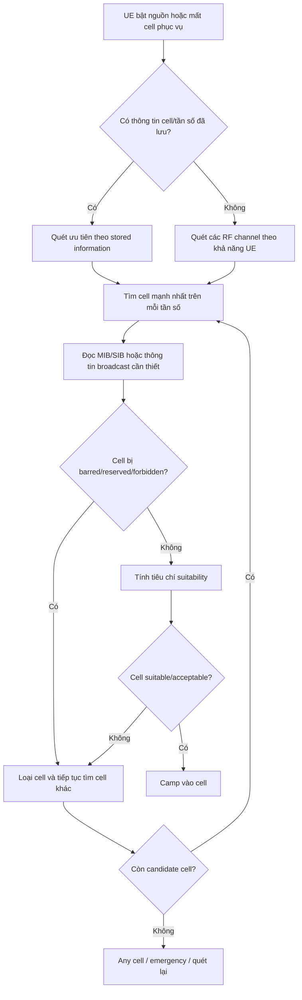
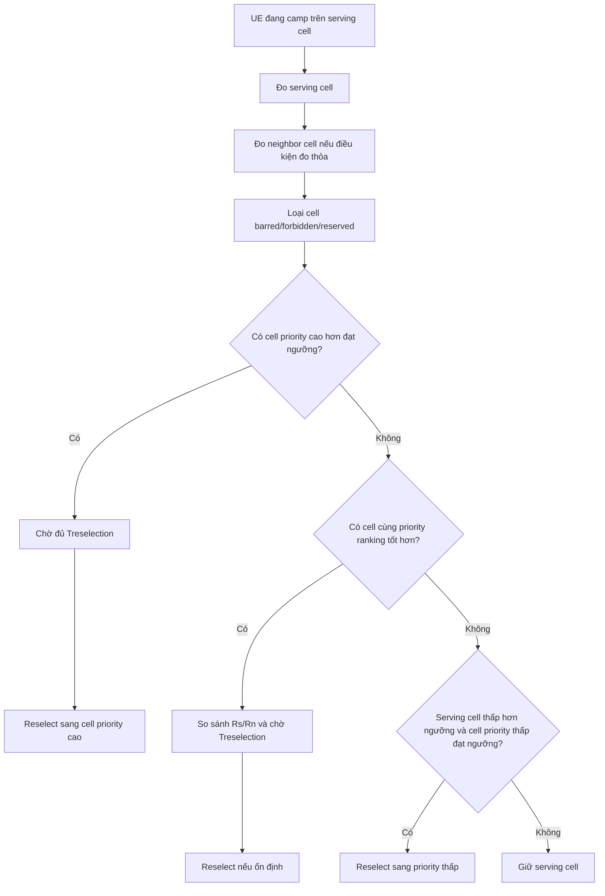

# CELL SELECTION TRONG MẠNG VÔ TUYẾN DI ĐỘNG

## 1. Tổng quan

**Cell Selection** là quá trình thiết bị người dùng, gọi là **UE – User Equipment**, tìm kiếm và lựa chọn một ô vô tuyến phù hợp để bám vào mạng, hay còn gọi là **camp on a cell**. Đây là một trong những cơ chế nền tảng của mạng di động, đặc biệt quan trọng trong các trạng thái như:

- UE vừa bật nguồn.
- UE vừa mất sóng hoặc mất ô đang phục vụ.
- UE rời khỏi trạng thái kết nối.
- UE cần tìm lại mạng sau khi di chuyển sang vùng phủ mới.
- UE cần chọn một ô phù hợp để nhận paging, đọc thông tin hệ thống và thực hiện truy nhập mạng.

Nói đơn giản, trước khi UE có thể gọi điện, nhắn tin, truyền dữ liệu, đăng ký mạng hoặc nhận paging, UE phải chọn được một cell phù hợp để camp. Vì vậy, Cell Selection là bước đầu tiên trong chuỗi hoạt động truy nhập mạng.

Tuy nhiên, Cell Selection không chỉ đơn giản là chọn cell có sóng mạnh nhất. Một cell được chọn phải thỏa mãn nhiều điều kiện khác nhau như:

- Có thuộc PLMN được phép hay không.
- Có bị cấm truy nhập hay không.
- Có đủ mức thu tín hiệu hay không.
- Có đủ chất lượng tín hiệu hay không.
- UE có đủ khả năng phát uplink đến cell đó hay không.
- Cell có hỗ trợ dịch vụ hoặc loại truy nhập cần thiết hay không.
- Cell có phù hợp với chính sách ưu tiên tần số/RAT của mạng hay không.

Trong thực tế vận hành, Cell Selection và Cell Reselection ảnh hưởng trực tiếp đến vùng phủ, chất lượng dịch vụ, cân bằng tải, tiêu thụ pin, độ ổn định mobility và trải nghiệm người dùng.

---

## 2. Phân biệt Cell Selection và Cell Reselection

Hai khái niệm này thường đi cùng nhau nhưng không giống nhau.

| Khái niệm | Ý nghĩa | Thời điểm xảy ra | Đặc điểm chính |
|---|---|---|---|
| **Cell Selection** | UE tìm và chọn cell phù hợp để camp lần đầu hoặc sau khi mất cell | Khi bật máy, mất sóng, rời connected/inactive | Chủ yếu là tìm cell suitable/acceptable |
| **Cell Reselection** | UE đang camp trên một cell và tự chuyển sang cell khác tốt hơn | Khi UE ở idle/inactive mode | Dùng thêm priority, ranking, hysteresis, timer, threshold |

Có thể hiểu ngắn gọn:

> **Cell Selection** là quá trình “tìm được cell đủ điều kiện để bám vào”.  
> **Cell Reselection** là quá trình “đang bám cell rồi nhưng quyết định có nên chuyển sang cell khác tốt hơn hay không”.

Trong LTE và NR, điểm rất quan trọng là **priority giữa các tần số/RAT thường không dùng trực tiếp trong initial cell selection**, mà chủ yếu được dùng trong quá trình **cell reselection** sau khi UE đã camp vào một cell.

---

## 3. Mục tiêu của Cell Selection

Cell Selection không chỉ nhằm mục tiêu có sóng. Nó là một bài toán tối ưu đa mục tiêu.

Các mục tiêu chính gồm:

1. **Đảm bảo vùng phủ**  
   UE phải tìm được cell phù hợp để camp càng nhanh càng tốt.

2. **Đảm bảo chất lượng radio**  
   Cell được chọn phải có mức thu và chất lượng tín hiệu đủ tốt.

3. **Đảm bảo khả năng uplink**  
   UE không chỉ nghe được cell; UE còn phải có khả năng phát ngược lên cell.

4. **Giảm ping-pong**  
   UE không nên chuyển qua lại liên tục giữa nhiều cell ở vùng biên.

5. **Cân bằng tải mạng**  
   UE có thể được điều hướng sang tần số, layer hoặc small cell phù hợp để tránh quá tải macro cell.

6. **Giảm signaling**  
   Nếu cell selection/reselection quá nhạy, UE sẽ tạo nhiều đo đạc, đọc SIB, reselection, registration update, tracking area update.

7. **Tiết kiệm pin UE**  
   Đo quét liên tục nhiều tần số và nhiều RAT làm tăng tiêu thụ năng lượng.

8. **Tối ưu trải nghiệm người dùng**  
   Chọn sai cell có thể dẫn đến attach chậm, data chậm, mất sóng, rớt kết nối hoặc chuyển vùng không ổn định.

Một cách mô hình hóa mục tiêu kỹ thuật:

\[
J = w_1 \cdot Coverage + w_2 \cdot Capacity + w_3 \cdot Throughput - w_4 \cdot Latency - w_5 \cdot Signaling - w_6 \cdot BatteryCost - w_7 \cdot PingPongRisk
\]

Trong đó:

- `Coverage`: khả năng UE tìm được cell hợp lệ.
- `Capacity`: khả năng phân bố tải hợp lý.
- `Throughput`: thông lượng người dùng.
- `Latency`: độ trễ truy nhập/camp/roaming.
- `Signaling`: tải báo hiệu.
- `BatteryCost`: chi phí năng lượng do đo quét.
- `PingPongRisk`: rủi ro chuyển qua lại liên tục.

Đây không phải là công thức chuẩn hóa bắt buộc của 3GPP, mà là cách biểu diễn để hiểu bản chất tối ưu trong vận hành mạng.

---

## 4. Các trạng thái liên quan đến Cell Selection

Trong mạng di động, Cell Selection chủ yếu liên quan đến các trạng thái RRC sau:

| Trạng thái | Ý nghĩa | Có liên quan Cell Selection/Reselection không? |
|---|---|---|
| **RRC_IDLE** | UE chưa có kết nối RRC active với mạng | Có, rất quan trọng |
| **RRC_INACTIVE** | Trạng thái trung gian trong 5G NR, UE giữ context nhưng không active hoàn toàn | Có, đặc biệt trong NR |
| **RRC_CONNECTED** | UE đang có kết nối RRC active | Cell change thường do handover/network control, không phải idle reselection thông thường |

Trong **Idle/Inactive**, UE tự đo đạc và tự quyết định reselection dựa trên thông tin mạng broadcast. Trong **Connected**, việc đổi cell chủ yếu do mạng điều khiển thông qua handover, mặc dù UE vẫn đo và báo cáo measurement.

---

## 5. Quy trình Cell Selection tổng quát

Quy trình cơ bản có thể mô tả như sau:

Các bước quan trọng:

### Bước 1: Quét tần số

UE quét các tần số/RAT mà nó hỗ trợ. Nếu UE có thông tin đã lưu từ lần camp trước, UE có thể ưu tiên quét các tần số/cell đã biết để rút ngắn thời gian tìm mạng.

### Bước 2: Phát hiện cell

UE tìm tín hiệu đồng bộ, đọc thông tin nhận dạng cell và kiểm tra cell có thể đọc được broadcast information hay không.

### Bước 3: Đọc thông tin hệ thống

UE cần đọc các thông tin như MIB/SIB để biết:

- Cell có bị barred không.
- Cell có cho phép truy nhập không.
- Ngưỡng `q-RxLevMin`, `q-QualMin` là bao nhiêu.
- Các tham số reselection như priority, threshold, hysteresis, timer.
- PLMN, TAC, tracking area, thông tin truy nhập.

### Bước 4: Kiểm tra suitability

UE tính các tiêu chí như C1, Srxlev, Squal tùy RAT.

### Bước 5: Camp vào cell

Nếu cell thỏa mãn điều kiện, UE camp vào cell đó và bắt đầu theo dõi paging, đọc system information, thực hiện registration/attach nếu cần.

---

## 6. Các loại cell trong quá trình lựa chọn

Không phải cell nào UE nhìn thấy cũng được phép camp. Có thể phân loại như sau:

| Loại cell | Ý nghĩa |
|---|---|
| **Suitable cell** | Cell phù hợp để UE camp bình thường, thỏa PLMN, không bị barred và đạt tiêu chí radio |
| **Acceptable cell** | Cell tối thiểu có thể dùng cho emergency service hoặc limited service |
| **Barred cell** | Cell bị cấm camp bình thường |
| **Reserved cell** | Cell dành riêng cho mục đích/operator/user class nhất định |
| **Forbidden cell** | Cell thuộc vùng hoặc PLMN mà UE không được phép dùng |
| **Candidate cell** | Cell đang được UE xem xét trong selection/reselection |
| **Serving cell** | Cell hiện tại UE đang camp hoặc đang được phục vụ |
| **Neighbor cell** | Cell lân cận được đo để so sánh/reselection |

Trong thực tế, nhiều lỗi “có sóng nhưng không vào mạng được” liên quan đến việc cell bị barred, PLMN không phù hợp, tracking area bị forbidden hoặc SIB broadcast sai.

---

## 7. Các đại lượng đo vô tuyến quan trọng

### 7.1 RSSI

**RSSI – Received Signal Strength Indicator** là tổng công suất thu được trên một băng đo, bao gồm cả tín hiệu mong muốn, nhiễu và giao thoa.

RSSI thường không đủ để quyết định cell tốt hay xấu vì nó có thể cao do nhiễu hoặc tải lớn.

### 7.2 RSRP trong LTE

**RSRP – Reference Signal Received Power** là công suất thu trung bình trên các resource element mang reference signal của LTE.

Ý nghĩa:

- Phản ánh cường độ tín hiệu tham chiếu từ cell.
- Phù hợp để đánh giá vùng phủ.
- Không phản ánh đầy đủ nhiễu và tải.

RSRP mạnh không đồng nghĩa throughput tốt nếu cell đang nhiễu hoặc quá tải.

### 7.3 RSRQ trong LTE

**RSRQ – Reference Signal Received Quality** phản ánh chất lượng tín hiệu, có liên hệ với RSRP và RSSI:

\[
RSRQ = \frac{N \times RSRP}{RSSI}
\]

Trong đó:

- `N` là số resource block trong bandwidth đo.
- `RSRP` là công suất tín hiệu tham chiếu.
- `RSSI` là tổng công suất thu.

Ý nghĩa:

- RSRQ giảm khi nhiễu tăng.
- RSRQ giảm khi cell tải cao.
- RSRQ giúp đánh giá chất lượng tốt hơn RSRP trong môi trường nhiễu.

### 7.4 SINR

**SINR – Signal to Interference plus Noise Ratio** là tỷ số giữa tín hiệu mong muốn và tổng nhiễu + giao thoa:

\[
SINR = \frac{Signal}{Interference + Noise}
\]

SINR rất quan trọng cho throughput, modulation, coding scheme và trải nghiệm dữ liệu. Tuy nhiên, trong cơ chế idle mode cell selection/reselection chuẩn hóa, LTE/NR thường dùng các tiêu chí như Srxlev/Squal dựa trên RSRP/RSRQ hoặc SS-RSRP/SS-RSRQ. SINR thường xuất hiện nhiều trong tối ưu handover, beam management, machine learning, load balancing hoặc thuật toán vendor.

### 7.5 SS-RSRP, SS-RSRQ, SS-SINR trong 5G NR

Trong 5G NR, đo đạc idle/inactive thường dựa trên **SSB – Synchronization Signal Block**.

Các đại lượng chính:

| Đại lượng | Ý nghĩa |
|---|---|
| **SS-RSRP** | Công suất thu trên tín hiệu đồng bộ/SSB |
| **SS-RSRQ** | Chất lượng thu dựa trên SS-RSRP và RSSI NR |
| **SS-SINR** | Tỷ số tín hiệu SS so với nhiễu + giao thoa |

NR khác LTE ở chỗ có yếu tố beam rõ ràng hơn. Một cell có thể có nhiều SSB/beam, nên cell tốt không chỉ là cell có một beam mạnh, mà còn là cell có tập beam ổn định và đủ nhiều beam vượt ngưỡng.

---

## 8. Công thức Cell Selection theo từng RAT

## 8.1 GSM: C1 và C2

Trong GSM, tiêu chí cơ bản là **C1**.

\[
C1 = A - max(B, 0)
\]

Trong đó:

\[
A = RLA\_C - RXLEV\_ACCESS\_MIN
\]

\[
B = MS\_TXPWR\_MAX\_CCH + POWER\_OFFSET - P
\]

Ý nghĩa:

- `RLA_C`: mức thu trung bình.
- `RXLEV_ACCESS_MIN`: mức thu tối thiểu để truy nhập.
- `MS_TXPWR_MAX_CCH`: công suất phát tối đa cho phép trên control channel.
- `P`: công suất phát tối đa mà MS hỗ trợ.

Điều kiện cơ bản:

\[
C1 > 0
\]

Nếu C1 > 0, cell được xem là có điều kiện đường truyền đủ tốt để camp.

### C2 trong GSM

C2 dùng cho reselection, bổ sung offset và penalty:

\[
C2 = C1 + CELL\_RESELECT\_OFFSET - TEMPORARY\_OFFSET \cdot H(PENALTY\_TIME - T)
\]

Ý nghĩa:

- `CELL_RESELECT_OFFSET`: tăng/giảm độ hấp dẫn của cell.
- `TEMPORARY_OFFSET`: phạt tạm thời cell mới.
- `PENALTY_TIME`: thời gian áp dụng penalty.
- `T`: thời gian cell đã được quan sát.

C2 giúp tránh việc UE chuyển cell quá sớm hoặc bị ping-pong.

---

## 8.2 UMTS: Srxlev và Squal

Trong UMTS, cell selection/reselection dùng tiêu chí S.

\[
S_{rxlev} = Q_{rxlevmeas} - Q_{rxlevmin} - P_{compensation}
\]

\[
S_{qual} = Q_{qualmeas} - Q_{qualmin}
\]

Cell phù hợp khi:

\[
S_{rxlev} > 0
\]

và nếu có áp dụng quality criterion:

\[
S_{qual} > 0
\]

Trong UMTS FDD:

- `Qrxlevmeas` thường liên quan đến CPICH RSCP.
- `Qqualmeas` thường liên quan đến CPICH Ec/No.
- `Pcompensation` phản ánh giới hạn công suất phát của UE.

UMTS cũng hỗ trợ các cơ chế ranking và HCS để xử lý hierarchical cell structure.

---

## 8.3 LTE: Srxlev, Squal và ranking Rs/Rn

Trong LTE, cell suitable khi thỏa mãn:

\[
S_{rxlev} = Q_{rxlevmeas} - (Q_{rxlevmin} + Q_{rxlevminoffset}) - P_{compensation} - Qoffset_{temp}
\]

\[
S_{qual} = Q_{qualmeas} - (Q_{qualmin} + Q_{qualminoffset}) - Qoffset_{temp}
\]

Điều kiện:

\[
S_{rxlev} > 0
\]

\[
S_{qual} > 0
\]

Trong đó:

| Tham số | Ý nghĩa |
|---|---|
| `Qrxlevmeas` | Mức đo RSRP |
| `Qqualmeas` | Mức đo RSRQ |
| `Qrxlevmin` | Mức RSRP tối thiểu do mạng broadcast |
| `Qqualmin` | Mức RSRQ tối thiểu |
| `Qrxlevminoffset` | Offset áp dụng trong một số trường hợp |
| `Qqualminoffset` | Offset quality |
| `Pcompensation` | Bù do giới hạn công suất phát UE |
| `Qoffsettemp` | Offset tạm thời, thường liên quan barring/reselection restriction |

### Ranking trong LTE

Với cell cùng priority hoặc intra-frequency, LTE dùng ranking:

\[
R_s = Q_{meas,s} + Q_{hyst} - Qoffset_{temp}
\]

\[
R_n = Q_{meas,n} - Qoffset - Qoffset_{temp}
\]

Trong đó:

- `Rs`: ranking của serving cell.
- `Rn`: ranking của neighbor cell.
- `Qhyst`: hysteresis cộng cho serving cell để tránh ping-pong.
- `Qoffset`: offset giữa serving và neighbor hoặc giữa frequency.
- `Qmeas`: thường dựa trên RSRP.

Neighbor cell chỉ được chọn khi nó tốt hơn serving cell một cách ổn định trong thời gian `Treselection`.

---

## 8.4 5G NR: Srxlev, Squal và beam-aware reselection

NR kế thừa logic của LTE nhưng dùng các đo đạc theo SSB:

\[
S_{rxlev} = Q_{rxlevmeas} - (Q_{rxlevmin} + Q_{rxlevminoffset}) - P_{compensation} - Qoffset_{temp}
\]

\[
S_{qual} = Q_{qualmeas} - (Q_{qualmin} + Q_{qualminoffset}) - Qoffset_{temp}
\]

Điều kiện cell suitable:

\[
S_{rxlev} > 0
\]

\[
S_{qual} > 0
\]

Trong NR:

- `Qrxlevmeas` thường liên quan đến SS-RSRP.
- `Qqualmeas` thường liên quan đến SS-RSRQ.
- Có thêm yếu tố beam/SSB.
- Hỗ trợ cả RRC_IDLE và RRC_INACTIVE.

### Ranking trong NR

Với equal-priority/intra-frequency:

\[
R_s = Q_{meas,s} + Q_{hyst} - Qoffset_{temp}
\]

\[
R_n = Q_{meas,n} - Qoffset - Qoffset_{temp}
\]

### Beam-aware cell reselection

NR có cơ chế chọn cell có xét đến beam, ví dụ thông qua các tham số như:

- `rangeToBestCell`
- `absThreshSS-BlocksConsolidation`

Ý nghĩa:

- UE không chỉ xem cell nào có RSRP tốt nhất.
- UE còn xem cell nào có nhiều beam/SSB vượt ngưỡng hơn.
- Điều này rất quan trọng trong môi trường FR2/mmWave hoặc deployment beam-based.

Một cell có đỉnh tín hiệu rất tốt nhưng chỉ có một beam ổn định chưa chắc tốt hơn cell có nhiều beam đủ mạnh và ổn định hơn.

---

## 9. So sánh Cell Selection theo GSM, UMTS, LTE và NR

| RAT | Đại lượng chính | Tiêu chí selection | Tiêu chí reselection | Đặc điểm nổi bật |
|---|---|---|---|---|
| **GSM** | RLA_C, RXLEV | C1 > 0 | C2, offset, penalty timer | Đơn giản, chú trọng khả năng UL/DL |
| **UMTS** | RSCP, Ec/No | Srxlev, Squal | Ranking, HCS | Có tiêu chí chất lượng và hierarchical cell |
| **LTE** | RSRP, RSRQ | Srxlev, Squal | Priority, Rs/Rn, Treselection | Cân bằng coverage, quality, priority |
| **5G NR** | SS-RSRP, SS-RSRQ, SS-SINR | Srxlev, Squal | Priority, Rs/Rn, beam consolidation | Hỗ trợ RRC_INACTIVE, beam-aware, relaxed measurement |

Nhìn theo tiến hóa công nghệ:

- GSM: logic đơn giản, chủ yếu dựa trên mức thu và công suất phát.
- UMTS: bổ sung chất lượng tín hiệu và cấu trúc cell phân tầng.
- LTE: chuẩn hóa mạnh hơn priority, threshold, hysteresis, timer.
- NR: kế thừa LTE nhưng thêm yếu tố beam, inactive state và tối ưu đo đạc.

---

## 10. Cell Reselection trong LTE/NR

Cell Reselection phức tạp hơn Cell Selection vì UE đã có serving cell và phải quyết định có nên rời cell đó hay không.

Quy trình đơn giản:

Các yếu tố chính trong reselection:

1. **Priority**  
   Frequency/RAT priority giúp mạng điều hướng UE sang layer mong muốn.

2. **Threshold**  
   Xác định khi nào được xét cell priority cao/thấp.

3. **Ranking**  
   So sánh serving cell với neighbor cell.

4. **Hysteresis**  
   Làm serving cell “dễ thắng hơn” để tránh ping-pong.

5. **Treselection**  
   Candidate cell phải tốt hơn trong một khoảng thời gian đủ dài.

6. **Barring/blacklist**  
   Loại cell không được phép camp.

7. **Mobility state**  
   UE di chuyển nhanh có thể được áp dụng scaling để giảm ping-pong.

8. **Relaxed measurement**  
   UE có thể giảm đo đạc khi điều kiện radio ổn định nhằm tiết kiệm pin.

---

## 11. Các tham số quan trọng trong cấu hình mạng

| Tham số | Vai trò |
|---|---|
| `q-RxLevMin` | Ngưỡng mức thu tối thiểu để cell được xem là suitable |
| `q-QualMin` | Ngưỡng chất lượng tối thiểu |
| `q-Hyst` | Hysteresis cho serving cell trong ranking |
| `Treselection` | Thời gian candidate cell phải duy trì điều kiện tốt hơn |
| `cellReselectionPriority` | Ưu tiên của frequency/RAT |
| `ThreshXHigh` | Ngưỡng để chọn tần số/RAT priority cao hơn |
| `ThreshXLow` | Ngưỡng để chọn tần số/RAT priority thấp hơn |
| `ThreshServingLow` | Ngưỡng serving cell bị xem là kém |
| `Qoffset` | Offset giữa cell/frequency để bias lựa chọn |
| `cellBarred` | Cấm UE camp vào cell |
| `intraFreqReselection` | Cho phép/cấm reselection trong cùng tần số |
| `TCRmax` | Cửa sổ thời gian đánh giá mobility state |
| `NCR_M` | Ngưỡng vào medium mobility |
| `NCR_H` | Ngưỡng vào high mobility |
| `rangeToBestCell` | Tham số NR để xét cell trong vùng gần best cell |
| `absThreshSS-BlocksConsolidation` | Ngưỡng beam/SSB trong NR |

---

## 12. Ý nghĩa của các tham số tuning

### 12.1 q-RxLevMin

`q-RxLevMin` quyết định mức tín hiệu tối thiểu mà UE cần thấy để coi cell có thể camp.

Nếu đặt quá cao:

- UE khó camp hơn.
- Tăng thời gian no suitable cell.
- Có thể gây mất sóng ở vùng biên hoặc indoor.

Nếu đặt quá thấp:

- UE dễ camp vào cell yếu.
- Rủi ro uplink yếu.
- Data chậm, attach chậm hoặc RLF sau đó.

### 12.2 q-QualMin

`q-QualMin` kiểm soát chất lượng tín hiệu, thường liên quan RSRQ/SS-RSRQ.

Nếu đặt quá cao:

- UE từ chối nhiều cell có RSRP đủ nhưng chất lượng không đạt.
- Có thể giảm coverage thực tế.

Nếu đặt quá thấp:

- UE dễ camp vào cell nhiễu hoặc tải cao.
- Throughput và access success có thể giảm.

### 12.3 q-Hyst

`q-Hyst` làm serving cell có lợi thế trong ranking.

Nếu `q-Hyst` thấp:

- UE dễ chuyển sang neighbor cell.
- Dễ ping-pong ở vùng biên.

Nếu `q-Hyst` cao:

- UE bám serving cell lâu hơn.
- Có thể bị “cell cling”, tức UE dính vào cell xấu quá lâu.

### 12.4 Treselection

`Treselection` là thời gian điều kiện reselection phải duy trì trước khi UE chuyển cell.

Nếu quá thấp:

- Reselection nhanh.
- Dễ ping-pong.

Nếu quá cao:

- Reselection chậm.
- UE có thể bỏ lỡ cell tốt hơn.

### 12.5 Priority

Priority cho phép operator điều hướng UE sang:

- 5G thay vì 4G.
- LTE layer dung lượng cao.
- Small cell.
- Carrier có băng thông lớn hơn.
- RAT phù hợp với dịch vụ.

Tuy nhiên, priority sai có thể làm UE bám vào layer không tối ưu.

### 12.6 Offset/Bias

Offset hoặc bias dùng để làm một cell/frequency trông hấp dẫn hơn hoặc kém hấp dẫn hơn.

Ví dụ:

- Tăng bias cho small cell để offload macro.
- Giảm bias cho cell nhiễu.
- Dùng Qoffset để điều chỉnh biên cell.

Rủi ro lớn nhất là bias quá mạnh làm UE vào vùng expanded region có nhiễu cao, dẫn đến throughput thấp.

---

## 13. Cell Range Expansion và Load Balancing

Trong mạng HetNet, gồm macro cell và small cell, nếu UE chỉ chọn theo tín hiệu mạnh nhất thì phần lớn UE sẽ bám vào macro cell vì macro phát công suất lớn hơn. Điều này dẫn đến:

- Macro quá tải.
- Small cell rảnh tài nguyên.
- Không tận dụng được cell splitting gain.

**Cell Range Expansion – CRE** giải quyết bằng cách cộng bias cho small cell, làm vùng phục vụ của small cell được mở rộng “ảo”.

Ví dụ:

\[
Score_{pico} = RSRP_{pico} + Bias_{CRE}
\]

Nếu `Bias_CRE` đủ lớn, UE có thể chọn pico dù RSRP pico thấp hơn macro.

Lợi ích:

- Offload UE khỏi macro.
- Tăng sử dụng small cell.
- Cải thiện capacity hệ thống.
- Có thể cải thiện fairness.

Rủi ro:

- UE ở vùng expanded region chịu nhiễu macro cao.
- Throughput cell-edge giảm nếu không có ICIC/eICIC/coordination.
- Bias tối ưu phụ thuộc tải, vị trí UE, phân bổ tài nguyên và deployment.

Kết luận thực tế:

> CRE/bias không nên được cấu hình theo kiểu “một giá trị đúng cho mọi nơi”. Nó phải được tối ưu theo từng khu vực, từng layer, từng mô hình tải và từng mục tiêu vận hành.

---

## 14. Mobility State Estimation

LTE và NR hỗ trợ cơ chế đánh giá trạng thái di chuyển của UE dựa trên số lần reselection trong một khoảng thời gian.

Các trạng thái thường gồm:

| Trạng thái | Ý nghĩa |
|---|---|
| **Normal mobility** | UE di chuyển chậm hoặc ổn định |
| **Medium mobility** | UE có số lần reselection tương đối nhiều |
| **High mobility** | UE di chuyển nhanh, nhiều reselection |

Các tham số:

- `TCRmax`: cửa sổ thời gian đếm reselection.
- `NCR_M`: ngưỡng medium mobility.
- `NCR_H`: ngưỡng high mobility.

Khi UE vào medium/high mobility, mạng có thể áp dụng scaling cho:

- `q-Hyst`
- `Treselection`

Mục tiêu là giảm ping-pong cho UE di chuyển nhanh, ví dụ trên xe, tàu hoặc đường cao tốc.

---

## 15. Relaxed Measurement

UE không nên đo tất cả neighbor frequency/RAT liên tục nếu serving cell đang tốt và UE ít di chuyển. Vì vậy, LTE/NR có cơ chế **relaxed measurement**.

Mục tiêu:

- Giảm tiêu thụ pin.
- Giảm số lần đo không cần thiết.
- Giảm xử lý baseband.
- Giảm signaling gián tiếp.

Điều kiện thường liên quan đến:

- UE ít di chuyển.
- Serving cell đủ tốt.
- UE không ở cell edge.
- Thời gian từ lần đo trước chưa quá giới hạn.
- Độ thay đổi Srxlev nhỏ.

Rủi ro nếu relaxed measurement quá mạnh:

- UE phát hiện cell tốt hơn chậm.
- UE chậm chuyển sang frequency/RAT priority cao hơn.
- Offload kém hiệu quả.

Do đó, relaxed measurement là đánh đổi giữa **pin** và **độ nhạy mobility/offload**.

---

## 16. Tác động của Cell Selection đến QoS

### 16.1 Tác động đến vùng phủ

Nếu threshold quá chặt, UE có thể không tìm được suitable cell dù thực tế vẫn có tín hiệu. Điều này làm tăng:

- No suitable cell time.
- Thời gian tìm mạng.
- Tỷ lệ mất sóng ở indoor/deep coverage.

Nếu threshold quá lỏng, UE camp vào cell yếu, dẫn đến:

- Access failure.
- Uplink yếu.
- Data chậm.
- RLF sau khi vào connected mode.

### 16.2 Tác động đến throughput

Chọn cell có RSRP mạnh nhất không luôn cho throughput cao nhất. Throughput còn phụ thuộc:

- RSRQ/SINR.
- Tải cell.
- Số UE active.
- Bandwidth.
- Scheduler.
- Interference.
- Layer priority.

Ví dụ: một macro cell RSRP mạnh nhưng PRB utilization 95% có thể cho throughput thấp hơn một small cell RSRP yếu hơn nhưng còn nhiều tài nguyên.

### 16.3 Tác động đến latency

Cell Selection ảnh hưởng đến:

- Time to camp.
- Initial access delay.
- Registration delay.
- Service request delay.

Stored information giúp giảm thời gian tìm cell, nhưng nếu thông tin đã cũ, UE có thể mất thêm thời gian quét sai tần số.

### 16.4 Tác động đến signaling

Cấu hình reselection quá nhạy làm tăng:

- Reselection count.
- SIB read.
- Tracking area update.
- Registration update.
- Measurement activity.

Signaling cao có thể làm tăng tải core/RAN và tiêu thụ pin UE.

### 16.5 Tác động đến pin UE

UE tiêu thụ pin nhiều hơn khi:

- Phải quét nhiều frequency/RAT.
- Cell serving yếu nên phải đo neighbor thường xuyên.
- Ping-pong reselection nhiều.
- Stored information không còn đúng.
- Relaxed measurement không được áp dụng.

---

## 17. KPI nên theo dõi

| KPI | Ý nghĩa | Dấu hiệu bất thường |
|---|---|---|
| **Camp success rate** | Tỷ lệ UE camp thành công | Thấp: threshold quá chặt, barring sai, SI lỗi |
| **Time to camp** | Thời gian từ khi tìm mạng đến khi camp | Cao: scan scope rộng, stored info lỗi |
| **No suitable cell time** | Thời gian UE không tìm được cell phù hợp | Cao: vùng phủ kém hoặc q-RxLevMin/q-QualMin quá cao |
| **Idle reselection count/UE** | Số lần reselection trên mỗi UE | Cao: ping-pong hoặc offset/timer sai |
| **Ping-pong ratio** | Tỷ lệ UE quay lại cell cũ trong thời gian ngắn | Cao: hysteresis/timer thấp |
| **RSRP percentile** | Phân bố mức phủ | Thấp: coverage kém hoặc UE camp cell xa |
| **RSRQ/SINR percentile** | Phân bố chất lượng | Thấp: interference/tải cao |
| **PRB utilization variance** | Mức lệch tải giữa các cell/layer | Cao: load balancing chưa tốt |
| **Expanded-region UE share** | Tỷ lệ UE trong vùng CRE | Cao kèm throughput thấp: bias quá mạnh |
| **TAU/registration update rate** | Mobility signaling idle | Cao: reselection churn |
| **HO failure/RLF** | Ảnh hưởng gián tiếp sau khi vào connected | Tăng sau tuning: selection đang đưa UE vào layer kém |
| **Relaxed measurement eligibility** | Tỷ lệ UE đủ điều kiện giảm đo | Thấp: UE phải đo quá nhiều |

---

## 18. Các lỗi thường gặp và hướng chẩn đoán

| Triệu chứng | Nguyên nhân thường gặp | Kiểm tra | Hướng xử lý ban đầu |
|---|---|---|---|
| UE có sóng nhưng không camp được | Cell barred, PLMN sai, Srxlev/Squal không đạt | MIB/SIB, cellBarred, q-RxLevMin, q-QualMin | Kiểm tra broadcast và ngưỡng selection |
| Camp chậm sau khi bật máy | Stored info cũ, scan nhiều band, SI đọc chậm | Trace power-on, scan log | Tối ưu frequency priority/stored info |
| Idle ping-pong nhiều | q-Hyst thấp, Treselection thấp, offset sai | Reselection log, neighbor ranking | Tăng hysteresis/timer hoặc chỉnh offset |
| UE bám cell xấu quá lâu | q-Hyst/Treselection quá cao | RSRP/RSRQ serving và neighbor | Giảm hysteresis/timer hợp lý |
| Macro quá tải, small cell rảnh | Bias/priority chưa đủ | PRB, UE distribution | Tăng bias/offload từng bước |
| Small cell nhiều UE nhưng throughput thấp | CRE bias quá cao, nhiễu expanded region | SINR/RSRQ vùng CRE | Giảm bias hoặc bổ sung ICIC/eICIC |
| Pin UE kém trong idle | Đo nhiều inter-frequency/RAT | Measurement activity, scan attempt | Bật/tối ưu relaxed measurement |
| UE tốc độ cao ping-pong small cell | Mobility state chưa hiệu quả | TCRmax, NCR_M, NCR_H | Tối ưu mobility scaling |
| NR chọn cell beam không ổn định | Beam consolidation chưa phù hợp | Beam count, SSB measurement | Tối ưu rangeToBestCell và ngưỡng SSB |

---

## 19. Ví dụ tuning minh họa

Các ví dụ dưới đây chỉ mang tính minh họa kỹ thuật. Trong thực tế, giá trị cụ thể phụ thuộc vendor, band, deployment, morphology, traffic pattern và mục tiêu operator.

| Mục tiêu | Điều chỉnh minh họa | Tác dụng | Rủi ro |
|---|---|---|---|
| Giảm ping-pong vùng biên | Tăng `q-Hyst`, tăng `Treselection` | Ổn định camping | UE bám cell xấu lâu hơn |
| Tăng khả năng camp vùng yếu | Giảm nhẹ `q-RxLevMin` hoặc `q-QualMin` | Giảm no suitable cell | UE camp vào cell chất lượng thấp |
| Offload macro sang small cell | Tăng bias/Qoffset cho small cell | Giảm tải macro | Nhiễu expanded region |
| Ưu tiên 5G NR | Tăng priority NR hoặc threshold phù hợp | UE bám NR nhiều hơn | Nếu NR coverage kém sẽ gây trải nghiệm không ổn định |
| Tiết kiệm pin idle | Kích hoạt relaxed measurement | Giảm đo quét | Phát hiện cell tốt chậm hơn |
| Giảm ping-pong UE tốc độ cao | Điều chỉnh mobility state scaling | Ổn định cho UE nhanh | Offload sang small cell chậm hơn |
| Tối ưu NR beam | Cấu hình beam consolidation | Chọn cell beam ổn định hơn | Có thể bỏ qua cell có peak RSRP cao |

---

## 20. So sánh Cell Selection và Wi-Fi BSS Selection

Trong Wi-Fi, khái niệm tương đương gần nhất là **BSS/AP Selection** hoặc roaming giữa các access point.

| Cellular | Wi-Fi |
|---|---|
| Cell selection/reselection | BSS/AP selection/roaming |
| UE camp vào cell | STA associate vào AP |
| RSRP/RSRQ/SINR | RSSI/SNR/channel utilization |
| Network broadcast priority/threshold | SSID policy, 802.11k/v/r, controller steering |
| Idle reselection do UE quyết định theo chuẩn | Roaming chủ yếu do client quyết định |

Điểm khác biệt lớn:

- Trong cellular, idle mode selection/reselection được chuẩn hóa rất chặt.
- Trong Wi-Fi, client thường có quyền quyết định roaming lớn hơn; AP/controller chỉ hỗ trợ steering.
- 802.11k/v/r giúp tối ưu roaming nhưng không hoàn toàn ép client như cơ chế cellular.

---

## 21. Checklist triển khai/tối ưu Cell Selection

### 21.1 Kiểm tra broadcast information

- `cellBarred`
- `intraFreqReselection`
- PLMN list
- TAC/tracking area
- q-RxLevMin
- q-QualMin
- Priority
- Threshold
- Qoffset
- q-Hyst
- Treselection

### 21.2 Kiểm tra đo đạc thực tế

- RSRP/SS-RSRP distribution.
- RSRQ/SS-RSRQ distribution.
- SINR distribution.
- Serving vs neighbor ranking.
- Cell-edge statistics.
- Indoor/deep coverage samples.

### 21.3 Kiểm tra mobility

- Reselection count.
- Ping-pong ratio.
- UE speed class.
- Mobility state scaling.
- TAU/registration update.

### 21.4 Kiểm tra tải

- PRB utilization.
- Active UE distribution.
- Macro/small cell load imbalance.
- Carrier load imbalance.
- Throughput by layer.

### 21.5 Kiểm tra tác động sau tuning

Sau khi đổi tham số selection/reselection, cần theo dõi:

- Camp success.
- Time to camp.
- No suitable cell.
- Reselection count.
- Ping-pong.
- RSRP/RSRQ/SINR.
- Throughput.
- HO failure.
- RLF.
- Battery-related measurement activity.

---

## 22. Kết luận

Cell Selection là cơ chế nền tảng quyết định UE có thể tìm và bám vào mạng như thế nào. Ở mức đơn giản, nó là quá trình chọn một cell phù hợp để camp. Nhưng ở mức vận hành mạng, nó là bài toán tối ưu giữa vùng phủ, chất lượng, tải, pin, signaling và mobility.

Các điểm cần nhớ:

1. **Cell Selection không phải chỉ là chọn sóng mạnh nhất.**  
   UE còn phải xét PLMN, barring, threshold, quality và khả năng uplink.

2. **Cell Selection và Cell Reselection khác nhau.**  
   Selection là tìm cell suitable; reselection là chọn cell tốt hơn khi UE đã camp.

3. **LTE/NR dùng Srxlev/Squal làm tiêu chí suitability.**  
   RSRP/RSRQ hoặc SS-RSRP/SS-RSRQ là các đại lượng đầu vào quan trọng.

4. **Priority chủ yếu phát huy trong reselection.**  
   Nó giúp operator điều hướng UE sang frequency/RAT/layer mong muốn.

5. **Hysteresis và Treselection kiểm soát độ ổn định mobility.**  
   Cấu hình quá thấp gây ping-pong; quá cao gây bám cell xấu.

6. **Bias/CRE giúp cân bằng tải nhưng có rủi ro nhiễu.**  
   Tăng bias small cell phải đi kèm đánh giá SINR, RSRQ và throughput.

7. **NR phức tạp hơn LTE vì có yếu tố beam.**  
   Cell tốt không chỉ là cell có RSRP cao mà còn là cell có beam set ổn định.

8. **Tối ưu Cell Selection phải dựa trên KPI thực tế.**  
   Không nên chỉnh threshold/offset/timer chỉ dựa trên lý thuyết hoặc một vùng đo nhỏ.

---

## 23. Tài liệu nền nên tham khảo

Các tài liệu chuẩn và tài liệu kỹ thuật nên đọc khi nghiên cứu sâu về Cell Selection:

- 3GPP TS 43.022 – GSM idle mode procedures.
- 3GPP TS 45.008 – GSM/EDGE radio subsystem link control.
- 3GPP TS 25.304 – UMTS UE idle mode and cell reselection.
- 3GPP TS 36.304 – LTE UE procedures in idle mode.
- 3GPP TS 36.214 – LTE physical layer measurements.
- 3GPP TS 36.331 – LTE RRC protocol, MIB/SIB, thresholds, priorities.
- 3GPP TS 38.304 – NR UE procedures in RRC_IDLE and RRC_INACTIVE.
- 3GPP TS 38.215 – NR physical layer measurements.
- 3GPP TS 38.331 – NR RRC protocol, MIB/SIB, barring, priority, beam-related parameters.
- 3GPP TS 38.300 – NR and NG-RAN overall description.
- 3GPP TR 36.902 – Self-Organizing Networks, Mobility Load Balancing.
- 3GPP TR 36.839 – Mobility enhancements for LTE HetNet.
- Qualcomm technical whitepaper về LTE Advanced Heterogeneous Networks.
- Các nghiên cứu về Cell Range Expansion, Q-learning, load balancing và machine learning cho handover/cell selection.

