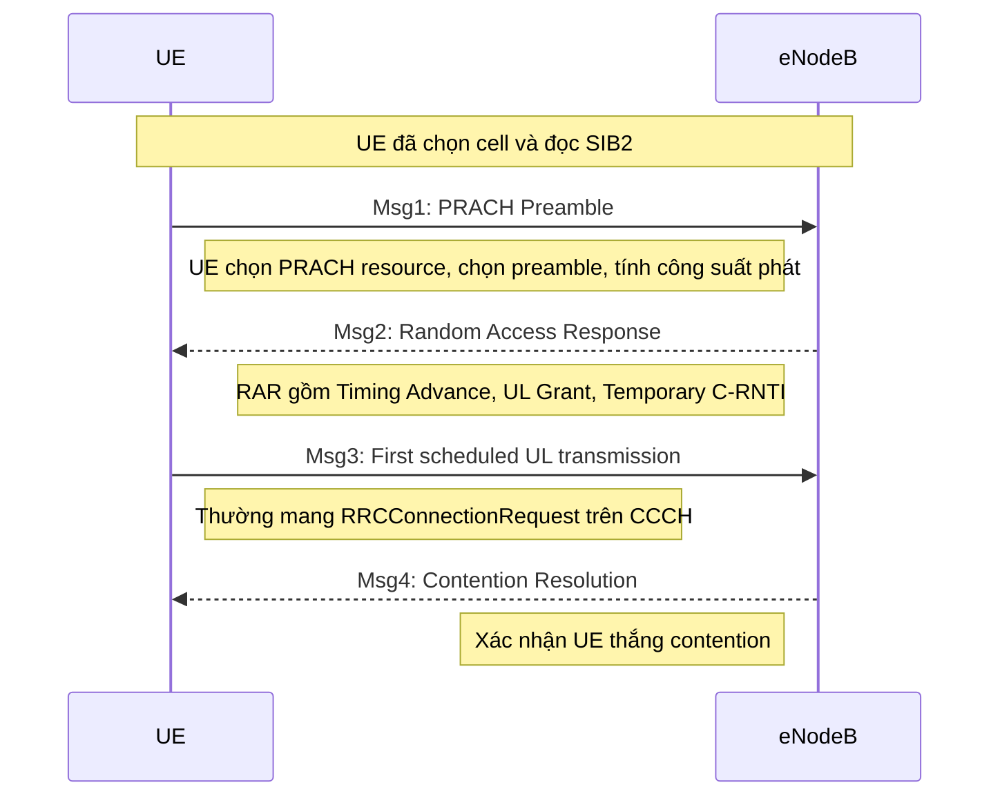

# Random Access trong LTE sau khi UE Cell Selection

## 1. Mục tiêu tài liệu

Tài liệu này giải thích chi tiết bước **Random Access** trong LTE sau khi UE đã thực hiện **cell selection** và bắt đầu truy nhập mạng. Trọng tâm là kịch bản phổ biến nhất:

> UE đang ở trạng thái **RRC_IDLE**, đã chọn được cell phù hợp, đã đọc thông tin hệ thống cần thiết, sau đó thực hiện Random Access để thiết lập đồng bộ uplink và gửi bản tin truy nhập đầu tiên lên mạng.

Trong LTE, bước này thường là **contention-based random access**, gồm 4 bản tin quen gọi là:

```text
Msg1 → Msg2 → Msg3 → Msg4
```

Tài liệu đi theo góc nhìn thực tế khi debug UE/eNodeB: UE đã camp vào cell, đã đọc SIB, sau đó vì sao cần Random Access, UE chọn PRACH như thế nào, mạng trả RAR ra sao, Msg3 được gửi thế nào, và contention resolution hoạt động ra sao.

---

## 2. Vị trí của Random Access sau Cell Selection

### 2.1. UE làm gì trước Random Access?

Sau khi bật máy hoặc mất kết nối, UE cần tìm và chọn một cell LTE phù hợp. Quá trình tổng quát trước Random Access thường gồm:

```text
Power on
  ↓
Frequency scan
  ↓
PSS/SSS detection
  ↓
Cell ID detection
  ↓
PBCH decode để đọc MIB
  ↓
Đọc SIB1
  ↓
Đọc SIB2
  ↓
Random Access
```

Trong đó:

| Bước | Vai trò |
|---|---|
| PSS/SSS | Giúp UE đồng bộ thời gian/tần số ban đầu và xác định physical cell ID |
| PBCH/MIB | Cho UE biết thông tin cơ bản như system bandwidth, PHICH, SFN |
| SIB1 | Cho biết cell có được phép truy nhập không, scheduling của các SIB khác |
| SIB2 | Chứa cấu hình radio common, đặc biệt là cấu hình RACH/PRACH |
| Random Access | UE xin truy nhập uplink, lấy timing advance, lấy uplink grant, gửi bản tin RRC đầu tiên |

Điểm quan trọng: **UE không thể thực hiện Random Access đúng nếu chưa đọc được SIB2**, vì SIB2 chứa các tham số cần thiết để biết khi nào và ở đâu được phát PRACH.

---

## 3. Vì sao cần Random Access?

Sau cell selection, UE mới chỉ đồng bộ tốt ở chiều **downlink**. UE đã nghe được eNodeB, đọc được broadcast information, nhưng mạng vẫn chưa biết chính xác UE ở đâu và UE chưa có tài nguyên uplink để truyền dữ liệu.

Random Access giải quyết các vấn đề sau:

### 3.1. Đồng bộ uplink

Do khoảng cách từ UE đến eNodeB khác nhau, tín hiệu uplink của mỗi UE sẽ đến eNodeB ở thời điểm khác nhau. Nếu không điều chỉnh, các UE có thể gây nhiễu lên nhau ở uplink.

Vì vậy, eNodeB cần đo thời điểm nhận PRACH từ UE rồi trả về **Timing Advance Command** trong Msg2. UE dùng Timing Advance để phát uplink sớm hơn một lượng phù hợp, giúp tín hiệu đến eNodeB đúng thời điểm.

### 3.2. Xin tài nguyên uplink ban đầu

UE chưa có uplink grant. Muốn gửi bản tin như `RRCConnectionRequest`, UE cần được eNodeB cấp tài nguyên PUSCH. Grant đầu tiên này được gửi trong **Random Access Response**, tức Msg2.

### 3.3. Thiết lập định danh tạm thời

Trong Msg2, eNodeB cấp cho UE một **Temporary C-RNTI**. Sau Msg4 thành công, Temporary C-RNTI có thể trở thành C-RNTI chính thức của UE trong cell.

### 3.4. Giải quyết tranh chấp

Với contention-based RA, nhiều UE có thể chọn cùng một preamble. Vì vậy, sau Msg3 cần có Msg4 để xác định UE nào thật sự thắng contention.

---

## 4. Các khái niệm cần phân biệt

| Thuật ngữ | Ý nghĩa |
|---|---|
| RACH | Random Access Channel ở mức transport channel/MAC procedure |
| PRACH | Physical Random Access Channel, kênh vật lý dùng để phát preamble Msg1 |
| Preamble | Chuỗi tín hiệu đặc biệt UE phát trên PRACH |
| RAPID | Random Access Preamble ID, dùng trong RAR để chỉ preamble nào được phản hồi |
| RA-RNTI | RNTI dùng để UE tìm Random Access Response trên PDCCH |
| RAR | Random Access Response, tức Msg2 |
| Temporary C-RNTI | Định danh tạm thời mạng cấp cho UE trong quá trình RA |
| C-RNTI | Định danh chính thức của UE trong cell sau khi truy nhập thành công |
| Msg1 | PRACH preamble |
| Msg2 | Random Access Response |
| Msg3 | First scheduled uplink transmission, thường mang RRCConnectionRequest |
| Msg4 | Contention Resolution |

Một điểm dễ nhầm:

> Chỉ Msg1 thực sự đi trên PRACH. Msg2 đi trên DL-SCH/PDSCH, Msg3 đi trên UL-SCH/PUSCH, Msg4 đi trên DL-SCH/PDSCH.

---

## 5. Hai loại Random Access trong LTE

LTE có hai loại Random Access chính.

### 5.1. Contention-Based Random Access - CBRA

Đây là loại thường dùng sau cell selection từ RRC_IDLE.

Đặc điểm:

- UE tự chọn ngẫu nhiên preamble trong tập preamble common.
- Có khả năng nhiều UE chọn cùng một preamble.
- Cần đủ 4 bước Msg1, Msg2, Msg3, Msg4.
- Cần contention resolution.

Các trigger phổ biến:

- Initial access từ RRC_IDLE.
- RRC connection establishment.
- RRC connection re-establishment.
- Uplink data arrival khi UE chưa đồng bộ uplink.
- Scheduling request trong một số trường hợp không có PUCCH resource.

### 5.2. Contention-Free Random Access - CFRA

Loại này dùng khi mạng cấp sẵn dedicated preamble cho UE.

Đặc điểm:

- eNodeB chỉ định preamble riêng cho UE.
- Gần như tránh được collision.
- Thường không cần Msg3/Msg4 theo nghĩa contention resolution.
- Hay dùng trong handover hoặc một số thủ tục đặc biệt.

Bảng so sánh:

| Tiêu chí | CBRA | CFRA |
|---|---|---|
| Ai chọn preamble? | UE tự chọn | eNodeB chỉ định |
| Có collision không? | Có thể có | Gần như không |
| Số bước | 4 bước | Thường 2 hoặc 3 bước tùy cách mô tả |
| Dùng sau cell selection? | Có, rất phổ biến | Không phải path chính |
| Cần Msg4? | Có | Thường không cần |

Trong tài liệu này, phần chính tập trung vào **CBRA sau cell selection**.

---

## 6. Điều kiện UE cần có trước khi phát Msg1

Trước khi phát PRACH preamble, UE cần lấy được các cấu hình từ SIB2, đặc biệt trong `radioResourceConfigCommon`, gồm các nhóm thông tin sau:

### 6.1. RACH-ConfigCommon

Bao gồm các thông số phục vụ logic Random Access ở MAC, ví dụ:

| Tham số | Ý nghĩa |
|---|---|
| numberOfRA-Preambles | Số lượng RA preamble khả dụng trong cell |
| preamblesGroupAConfig | Cấu hình nhóm preamble A/B |
| powerRampingParameters | Cấu hình tăng công suất khi phát lại preamble |
| ra-SupervisionInfo | Các timer/counter giám sát Random Access |
| preambleInitialReceivedTargetPower | Công suất mục tiêu ban đầu tại eNodeB |
| preambleTransMax | Số lần phát preamble tối đa |
| ra-ResponseWindowSize | Thời gian UE chờ RAR sau Msg1 |
| mac-ContentionResolutionTimer | Thời gian UE chờ contention resolution sau Msg3 |
| maxHARQ-Msg3Tx | Số lần HARQ tối đa cho Msg3 |

### 6.2. PRACH-Config

Bao gồm các thông số phục vụ phát preamble ở lớp vật lý:

| Tham số | Ý nghĩa |
|---|---|
| rootSequenceIndex | Chỉ root sequence dùng để sinh preamble |
| prach-ConfigIndex | Quy định PRACH opportunity theo thời gian |
| highSpeedFlag | Chỉ restricted/unrestricted set |
| zeroCorrelationZoneConfig | Cấu hình vùng zero correlation |
| prach-FreqOffset | Vị trí PRACH trên miền tần số |

Nói ngắn gọn:

```text
SIB2 cho UE biết:
- Có bao nhiêu preamble được phép chọn
- Preamble được sinh từ root nào
- Khi nào được phát PRACH
- PRACH nằm ở đâu trên miền tần số
- Phát với công suất bao nhiêu
- Chờ RAR trong bao lâu
- Retry bao nhiêu lần
```

---

## 7. Tổng quan luồng Random Access 4 bước

Luồng contention-based Random Access sau cell selection:



Dưới góc nhìn kênh:

| Bản tin | Nội dung chính | Kênh vật lý/transport |
|---|---|---|
| Msg1 | Random Access Preamble | PRACH |
| Msg2 | RAR | PDCCH + PDSCH/DL-SCH |
| Msg3 | RRCConnectionRequest hoặc MAC CE/CCCH SDU | PUSCH/UL-SCH |
| Msg4 | Contention Resolution | PDCCH + PDSCH/DL-SCH |

---

## 8. Msg1 - PRACH Preamble

### 8.1. Mục đích của Msg1

Msg1 là tín hiệu đầu tiên UE phát lên uplink trong thủ tục Random Access. Nó không mang dữ liệu RRC đầy đủ, mà chỉ là một preamble đặc biệt để eNodeB phát hiện sự tồn tại của UE và ước lượng timing uplink.

Msg1 giúp eNodeB:

- Biết có UE đang muốn truy nhập.
- Nhận diện preamble index UE đã chọn.
- Ước lượng timing offset của UE.
- Chuẩn bị phản hồi RAR ở Msg2.

### 8.2. UE chọn PRACH resource

UE dựa vào `prach-ConfigIndex` và `prach-FreqOffset` trong SIB2 để xác định:

```text
- Subframe nào được phép phát PRACH
- Vị trí tần số nào được dùng cho PRACH
- Preamble format nào được sử dụng
```

Ví dụ trong LTE FDD, nếu `prach-ConfigIndex = 6`, cấu hình thường được mô tả là PRACH opportunity xuất hiện ở subframe 1 và 6 của mỗi radio frame, với preamble format 0.

### 8.3. UE chọn preamble

Trong contention-based RA, UE chọn ngẫu nhiên một preamble trong tập preamble được phép.

Nếu chỉ có Group A:

```text
UE chọn preamble trong Group A
```

Nếu có cả Group A và Group B, UE chọn nhóm dựa trên:

- Kích thước Msg3 dự kiến.
- Pathloss ước lượng.
- Công suất phát tối đa `PCMAX`.
- Các ngưỡng như `messageSizeGroupA`, `messagePowerOffsetGroupB`, `deltaPreambleMsg3`.

Ý nghĩa thực tế:

- **Group A** thường dành cho Msg3 nhỏ hoặc UE có điều kiện uplink không tốt.
- **Group B** có thể dành cho Msg3 lớn hơn, nếu UE đủ công suất phát.

### 8.4. Cấu trúc preamble

PRACH preamble LTE gồm hai phần:

```text
Cyclic Prefix + Sequence Part
```

Với các format thông dụng 0, 1, 2, 3, preamble được sinh từ Zadoff-Chu sequence có độ dài 839. Các cyclic shift khác nhau tạo ra nhiều preamble khác nhau từ cùng root sequence.

Ý nghĩa khi debug:

- Nếu root sequence sai, eNodeB có thể không detect được preamble.
- Nếu zeroCorrelationZoneConfig sai, các preamble có thể bị lẫn nhau.
- Nếu highSpeedFlag/restricted set sai, UE và eNodeB có thể hiểu khác nhau về tập preamble hợp lệ.

### 8.5. Tính công suất phát Msg1

UE không phát PRACH với công suất tùy ý. UE tính công suất dựa trên:

```text
preambleInitialReceivedTargetPower
DELTA_PREAMBLE
powerRampingStep
PREAMBLE_TRANSMISSION_COUNTER
Pathloss
PCMAX
```

Công thức logic thường hiểu như sau:

```text
PREAMBLE_RECEIVED_TARGET_POWER
= preambleInitialReceivedTargetPower
  + DELTA_PREAMBLE
  + (PREAMBLE_TRANSMISSION_COUNTER - 1) × powerRampingStep
```

Công suất phát PRACH:

```text
P_PRACH = min(PCMAX, PREAMBLE_RECEIVED_TARGET_POWER + pathloss)
```

Ví dụ:

```text
preambleInitialReceivedTargetPower = -104 dBm
powerRampingStep = 2 dB
DELTA_PREAMBLE = 0 dB
Pathloss = 110 dB
PCMAX = 23 dBm
```

Lần phát đầu:

```text
Target = -104 dBm
P_PRACH = min(23, -104 + 110) = 6 dBm
```

Nếu fail và retry lần 2:

```text
Target = -102 dBm
P_PRACH = min(23, -102 + 110) = 8 dBm
```

Vì vậy trong log, nếu PRACH fail nhiều lần, ta thường thấy công suất PRACH tăng dần theo `powerRampingStep`.

---

## 9. RA-RNTI - UE tìm Msg2 bằng cách nào?

Sau khi phát Msg1, UE cần nghe PDCCH để tìm Random Access Response. Nhưng lúc này UE chưa có C-RNTI chính thức. Vì vậy LTE dùng một định danh đặc biệt là **RA-RNTI**.

### 9.1. RA-RNTI phụ thuộc vào PRACH opportunity

Với LTE FDD thông thường:

```text
RA-RNTI = 1 + t_id + 10 × f_id
```

Trong đó:

| Thành phần | Ý nghĩa |
|---|---|
| t_id | Index subframe nơi UE phát PRACH trong radio frame |
| f_id | Index PRACH resource trên miền tần số trong subframe đó |

Ví dụ:

```text
UE phát PRACH ở subframe 1
f_id = 0
RA-RNTI = 1 + 1 + 10 × 0 = 2
```

### 9.2. RA-RNTI không định danh duy nhất UE

RA-RNTI chỉ phụ thuộc vào PRACH opportunity, không phụ thuộc vào UE. Vì vậy nhiều UE phát PRACH trong cùng một PRACH opportunity sẽ theo dõi cùng một RA-RNTI.

Do đó, trong Msg2 cần thêm **RAPID** để UE biết RAR entry nào tương ứng với preamble mình đã phát.

Có thể hiểu như sau:

```text
RA-RNTI: tìm đúng gói RAR trên PDCCH/PDSCH
RAPID: tìm đúng entry bên trong RAR MAC PDU
Temporary C-RNTI: định danh tạm UE sau khi nhận RAR
```

---

## 10. Msg2 - Random Access Response

### 10.1. UE chờ Msg2 khi nào?

Sau khi phát xong Msg1, UE mở cửa sổ chờ RAR. Thời gian chờ được cấu hình bởi:

```text
ra-ResponseWindowSize
```

Các giá trị thường gặp theo chuẩn là:

```text
sf2, sf3, sf4, sf5, sf6, sf7, sf8, sf10
```

Nghĩa là cửa sổ chờ có độ dài 2, 3, 4, 5, 6, 7, 8 hoặc 10 subframe.

UE bắt đầu theo dõi RAR từ thời điểm sau khi preamble kết thúc cộng thêm một khoảng xử lý quy định. Trong triển khai/debug thường hiểu là UE chờ RAR trong cửa sổ RAR sau Msg1.

### 10.2. Msg2 đi trên kênh nào?

Msg2 không đi trên PRACH. Msg2 được truyền xuống UE qua:

```text
PDCCH dùng RA-RNTI để chỉ DL assignment
PDSCH/DL-SCH mang MAC RAR PDU
```

UE sẽ:

1. Theo dõi PDCCH bằng RA-RNTI.
2. Nếu có PDCCH CRC scrambled bằng RA-RNTI, UE đọc PDSCH tương ứng.
3. UE parse MAC RAR PDU.
4. UE tìm RAR subheader có RAPID trùng với preamble đã phát.

### 10.3. Nội dung chính của RAR

Một RAR entry thông thường gồm:

| Trường | Kích thước | Ý nghĩa |
|---|---:|---|
| Timing Advance Command | 11 bit | Chỉ UE điều chỉnh thời điểm phát uplink |
| UL Grant | 20 bit | Cấp tài nguyên cho Msg3 trên PUSCH |
| Temporary C-RNTI | 16 bit | Định danh tạm thời cho UE |

Ngoài ra MAC RAR PDU có thể có **Backoff Indicator**.

### 10.4. Backoff Indicator

Backoff Indicator, viết tắt BI, là thông tin mạng gửi để yêu cầu UE chờ ngẫu nhiên trước khi thử lại Random Access nếu lần hiện tại không thành công.

BI thường ánh xạ ra các giá trị như:

```text
0, 10, 20, 30, 40, 60, 80, 120, 160, 240, 320, 480, 960 ms
```

Nếu RAR không chứa BI, UE thường coi backoff parameter là 0 ms.

### 10.5. Khi nào Msg2 được xem là thành công?

UE xem RAR reception thành công khi:

```text
- UE nhận được PDCCH dùng đúng RA-RNTI
- UE decode được PDSCH chứa RAR
- Trong RAR MAC PDU có RAPID trùng với preamble UE đã phát
```

Nếu không có RAPID khớp, UE xem như chưa nhận được RAR hợp lệ cho mình.

---

## 11. Timing Advance trong Msg2

### 11.1. Vì sao cần Timing Advance?

Uplink LTE cần các UE đến eNodeB đúng timing. Nếu UE ở xa, tín hiệu đến muộn hơn UE ở gần. eNodeB dùng PRACH để ước lượng sai lệch timing và gửi Timing Advance trong RAR.

UE sau đó phát uplink sớm hơn một lượng tương ứng.

### 11.2. Timing Advance trong RAR

Timing Advance Command trong RAR dài 11 bit.

Công thức thường dùng:

```text
N_TA = TA × 16Ts
```

Trong LTE:

```text
Ts = 1 / (15000 × 2048)
```

Suy ra:

```text
16Ts ≈ 0.520833 microsecond
```

Quy đổi khoảng cách một chiều, một bước Timing Advance tương ứng xấp xỉ:

```text
78.125 mét
```

Ví dụ nếu RAR mang:

```text
TA = 32
```

Thì:

```text
N_TA = 32 × 16Ts ≈ 16.667 microsecond
```

Khoảng cách một chiều xấp xỉ:

```text
32 × 78.125 m = 2500 m
```

Tức khoảng 2.5 km.

### 11.3. Phân biệt RAR TA và TA MAC CE

Không nên nhầm:

| Loại TA | Kích thước | Vai trò |
|---|---:|---|
| TA trong RAR | 11 bit | Thiết lập timing ban đầu trong Random Access |
| TA MAC CE sau đó | 6 bit | Cập nhật timing tương đối khi UE đã kết nối |

---

## 12. UL Grant trong Msg2

UL Grant trong RAR cấp tài nguyên để UE gửi Msg3.

Trong LTE thông thường, RAR UL Grant dài 20 bit, gồm các thông tin như:

| Trường | Ý nghĩa |
|---|---|
| Hopping flag | Có dùng frequency hopping hay không |
| RB assignment | Chỉ tài nguyên uplink cho Msg3 |
| Truncated MCS | Chỉ modulation/coding cho Msg3 |
| TPC command | Điều chỉnh công suất PUSCH Msg3 |
| UL delay | Có trì hoãn Msg3 sang UL subframe phù hợp tiếp theo không |
| CSI request | Trong CBRA thường reserved |

Khi debug Msg3 fail, cần kiểm tra kỹ UL Grant vì UE phải phát Msg3 đúng:

```text
- Đúng RB
- Đúng MCS
- Đúng công suất
- Đúng subframe
- Đúng Temporary C-RNTI context
```

---

## 13. Msg3 - First Scheduled Uplink Transmission

### 13.1. Msg3 là gì?

Msg3 là bản tin uplink đầu tiên UE gửi sau khi nhận RAR. Nó không còn đi trên PRACH nữa, mà đi trên:

```text
PUSCH / UL-SCH
```

Tài nguyên để phát Msg3 lấy từ UL Grant trong Msg2.

Trong initial access sau cell selection, Msg3 thường mang:

```text
RRCConnectionRequest
```

Bản tin này thường đi trên CCCH.

### 13.2. Nội dung RRCConnectionRequest

`RRCConnectionRequest` thường chứa các thông tin như:

| Trường | Ý nghĩa |
|---|---|
| ue-Identity | Định danh UE, có thể là S-TMSI hoặc random value |
| establishmentCause | Lý do thiết lập RRC connection |

Ví dụ establishment cause:

```text
- emergency
- highPriorityAccess
- mt-Access
- mo-Signalling
- mo-Data
```

### 13.3. Khi nào UE phát Msg3?

UE phát Msg3 dựa trên timing của RAR và quy tắc scheduling. Trong LTE thông thường, Msg3 được phát ở một uplink subframe sau RAR, với độ trễ tối thiểu theo quy định.

Khi debug, cần kiểm tra:

```text
RAR nhận ở subframe nào
UL Grant chỉ tài nguyên nào
UL delay có bật không
Subframe phát Msg3 có đúng không
```

### 13.4. Msg3 HARQ

Msg3 có cơ chế HARQ riêng. Số lần truyền lại tối đa phụ thuộc tham số:

```text
maxHARQ-Msg3Tx
```

Cần phân biệt:

| Cơ chế | Điều khiển cái gì? |
|---|---|
| preambleTransMax | Số lần thử phát Msg1/preamble |
| maxHARQ-Msg3Tx | Số lần HARQ cho Msg3 |
| mac-ContentionResolutionTimer | Thời gian chờ Msg4 sau Msg3 |

---

## 14. Msg4 - Contention Resolution

### 14.1. Vì sao cần Msg4?

Trong CBRA, có thể xảy ra tình huống:

```text
UE A và UE B chọn cùng preamble
Cả hai đều nhận cùng RAR
Cả hai đều dùng cùng UL Grant để phát Msg3
```

Khi đó eNodeB cần xác định UE nào được chấp nhận. Đây là vai trò của Msg4.

### 14.2. UE chờ Msg4 bằng timer nào?

Sau khi phát Msg3, UE khởi động:

```text
mac-ContentionResolutionTimer
```

Các giá trị thường gặp:

```text
sf8, sf16, sf24, sf32, sf40, sf48, sf56, sf64
```

Nếu hết timer mà UE không nhận được contention resolution hợp lệ, thủ tục Random Access thất bại và UE phải retry.

### 14.3. UE Contention Resolution Identity

Trong initial access, Msg3 thường mang CCCH SDU. Khi phản hồi Msg4, mạng gửi **UE Contention Resolution Identity MAC CE**.

UE kiểm tra identity này có khớp với nội dung đã gửi trong Msg3 hay không.

Nguyên tắc:

```text
UE Contention Resolution Identity = 48 bit đầu của CCCH SDU trong Msg3
```

Nếu khớp:

```text
Random Access thành công
Temporary C-RNTI trở thành C-RNTI
UE tiếp tục quá trình RRC connection setup
```

Nếu không khớp hoặc không nhận được Msg4:

```text
Contention resolution thất bại
UE flush Msg3 HARQ buffer
UE bỏ Temporary C-RNTI
UE backoff và thử lại Random Access
```

---

## 15. Bảng tổng hợp timer và tham số quan trọng

| Tham số | Giá trị/miền giá trị | Vai trò |
|---|---|---|
| ra-ResponseWindowSize | sf2, sf3, sf4, sf5, sf6, sf7, sf8, sf10 | Thời gian UE chờ RAR sau Msg1 |
| preambleTransMax | n3, n4, n5, n6, n7, n8, n10, n20, n50, n100, n200 | Số lần phát preamble tối đa |
| mac-ContentionResolutionTimer | sf8, sf16, sf24, sf32, sf40, sf48, sf56, sf64 | Thời gian UE chờ Msg4 sau Msg3 |
| powerRampingStep | dB0, dB2, dB4, dB6 | Bước tăng công suất khi retry preamble |
| preambleInitialReceivedTargetPower | khoảng -120 dBm đến -90 dBm, bước 2 dB | Mức công suất mục tiêu ban đầu tại eNodeB |
| maxHARQ-Msg3Tx | 1 đến 8 | Số lần HARQ tối đa cho Msg3 |
| backoffIndicator | 0 đến 960 ms theo bảng BI | Thời gian backoff ngẫu nhiên trước retry |

Lưu ý quan trọng:

> Các tham số này không nên được hiểu là có “default cố định” cho mọi mạng LTE. Chúng được mạng cấu hình và broadcast/signaling cho UE.

---

## 16. Cơ chế retry và backoff

Random Access có thể thất bại ở nhiều điểm khác nhau. Khi thất bại, UE không retry ngay lập tức một cách vô hạn, mà tuân theo counter, timer và backoff.

### 16.1. Không nhận được RAR

Nếu UE phát Msg1 nhưng không nhận được RAR trong `ra-ResponseWindowSize`:

```text
RAR reception failed
  ↓
Tăng PREAMBLE_TRANSMISSION_COUNTER
  ↓
Nếu chưa vượt preambleTransMax → backoff rồi thử lại
  ↓
Nếu vượt giới hạn → báo Random Access problem lên upper layer
```

### 16.2. Có RAR nhưng không có RAPID khớp

Trường hợp UE nhận được PDCCH/PDSCH theo RA-RNTI nhưng trong MAC RAR PDU không có RAPID trùng với preamble UE đã phát.

Khi đó UE cũng xem như RAR không thành công.

### 16.3. Msg3 fail

Msg3 có thể fail do:

- UL Grant sai hoặc UE hiểu sai grant.
- PUSCH phát sai subframe.
- Sai công suất PUSCH.
- Timing Advance không đủ chính xác.
- Collision với UE khác.
- eNodeB không decode được Msg3.

Nếu Msg3 fail, UE có thể HARQ retransmission trong giới hạn `maxHARQ-Msg3Tx`. Nếu cuối cùng không có contention resolution hợp lệ, RA thất bại.

### 16.4. Msg4 fail

Msg4 fail khi:

- UE không nhận được PDCCH/PDSCH chứa contention resolution.
- UE nhận được nhưng UE Contention Resolution Identity không khớp.
- `mac-ContentionResolutionTimer` hết hạn.

Khi đó UE bỏ Temporary C-RNTI, flush Msg3 buffer và retry RA nếu chưa vượt giới hạn.

---

## 17. Các lỗi thường gặp khi debug Random Access

### 17.1. UE không phát PRACH

Nguyên nhân có thể:

- UE chưa đọc được SIB2.
- `prach-ConfigIndex` không hợp lệ hoặc UE parse sai.
- Cell barred hoặc không được phép truy nhập.
- UE chưa thỏa điều kiện RRC establishment.
- Lỗi MAC/RRC trigger Random Access.

Cần kiểm tra:

```text
MIB decode OK?
SIB1 decode OK?
SIB2 decode OK?
rach-ConfigCommon có đầy đủ không?
prach-Config có đầy đủ không?
```

### 17.2. UE phát PRACH nhưng eNodeB không detect

Nguyên nhân có thể:

- Sai rootSequenceIndex.
- Sai zeroCorrelationZoneConfig.
- Sai highSpeedFlag/restricted set.
- Sai PRACH frequency offset.
- UE phát sai subframe PRACH.
- Công suất PRACH quá thấp.
- Sai pathloss estimation.
- Lỗi RF hoặc đồng bộ tần số.

Checklist:

```text
Đối chiếu prach-ConfigIndex với subframe thực tế
Đối chiếu prach-FreqOffset với vị trí PRB thực tế
Tính lại P_PRACH bằng tay
Kiểm tra root sequence và cyclic shift
Kiểm tra capture IQ nếu có
```

### 17.3. UE nhận được RAR nhưng không gửi Msg3

Nguyên nhân có thể:

- RAR không có RAPID khớp.
- UE parse sai MAC RAR.
- UL Grant không hợp lệ.
- UE không xử lý đúng Temporary C-RNTI.
- Lỗi MAC-PHY interface khi yêu cầu phát PUSCH.

Cần kiểm tra:

```text
RA-RNTI có đúng không?
RAPID có khớp preamble không?
UL Grant parse đúng 20 bit không?
TA có được apply không?
Temporary C-RNTI có được lưu không?
```

### 17.4. Msg3 gửi nhưng eNodeB không decode

Nguyên nhân có thể:

- UE dùng sai RB assignment.
- UE dùng sai MCS.
- UE phát sai timing do TA sai.
- UE phát sai công suất PUSCH.
- Collision với UE khác.
- Sai scrambling/Temporary C-RNTI context.

Cần kiểm tra:

```text
Subframe Msg3 có đúng n+k không?
RB trên PUSCH có đúng UL Grant không?
MCS có đúng truncated MCS không?
PUSCH power có đúng không?
HARQ process cho Msg3 có đúng không?
```

### 17.5. Msg4 fail

Nguyên nhân có thể:

- eNodeB không gửi contention resolution.
- UE không decode được PDCCH/PDSCH.
- UE Contention Resolution Identity không khớp.
- `mac-ContentionResolutionTimer` quá ngắn so với xử lý mạng.
- Collision, chỉ UE khác thắng contention.

Cần kiểm tra:

```text
Msg4 có được scheduling bằng Temporary C-RNTI không?
MAC PDU có UE Contention Resolution Identity MAC CE không?
48 bit identity có khớp CCCH SDU trong Msg3 không?
Timer contention resolution có hết hạn không?
```

---

## 18. Ví dụ luồng thời gian Random Access

Giả sử:

```text
LTE FDD
prach-ConfigIndex = 6
PRACH opportunity ở subframe 1 và 6
UE phát Msg1 tại SFN 100, subframe 1
f_id = 0
ra-ResponseWindowSize = sf5
mac-ContentionResolutionTimer = sf48
```

Tính RA-RNTI:

```text
RA-RNTI = 1 + t_id + 10 × f_id
         = 1 + 1 + 10 × 0
         = 2
```

Timeline minh họa:

| Mốc | SFN.Subframe | Ý nghĩa |
|---|---:|---|
| Msg1 | 100.1 | UE phát PRACH preamble |
| RAR window mở | khoảng 100.4 | UE bắt đầu chờ RAR |
| Msg2 | ví dụ 100.5 | UE nhận RAR bằng RA-RNTI = 2 |
| Msg3 | ví dụ 101.1 | UE phát RRCConnectionRequest trên PUSCH |
| Msg4 | ví dụ 101.4 | eNodeB gửi contention resolution |
| Timer hết hạn | phụ thuộc sf48 | Nếu không có Msg4 hợp lệ, UE retry |

Ý nghĩa khi debug:

```text
Nếu Msg1 ở 100.1 thì UE không nên tìm RAR lung tung ở mọi nơi.
UE phải tìm PDCCH theo RA-RNTI tương ứng với PRACH opportunity đó.
Nếu nhận RAR ở 100.5 thì Msg3 phải bám theo UL Grant trong RAR.
Nếu Msg3 phát sai subframe hoặc sai RB, eNodeB sẽ không decode được.
```

---

## 19. Chuỗi xử lý nội bộ của UE

Có thể hình dung logic UE ở mức MAC như sau:

```text
Random Access triggered
  ↓
Flush Msg3 buffer
  ↓
Set PREAMBLE_TRANSMISSION_COUNTER = 1
  ↓
Chọn preamble group A/B
  ↓
Chọn random preamble
  ↓
Chọn PRACH resource
  ↓
Tính PRACH power
  ↓
Phát Msg1
  ↓
Chờ RAR trong ra-ResponseWindowSize
  ↓
Nếu RAR + RAPID match:
      Apply Timing Advance
      Lưu Temporary C-RNTI
      Dùng UL Grant phát Msg3
      Start mac-ContentionResolutionTimer
      Chờ Msg4
      Nếu contention resolution thành công:
          RA success
      Ngược lại:
          retry/backoff
  Ngược lại:
      retry/backoff
```

---

## 20. Tóm tắt theo từng bản tin

| Bản tin | Ai gửi? | Mục tiêu | Nội dung quan trọng | Nếu lỗi thì sao? |
|---|---|---|---|---|
| Msg1 | UE → eNodeB | Báo UE muốn truy nhập, giúp eNodeB đo timing | Preamble trên PRACH | UE không nhận RAR, tăng counter và retry |
| Msg2 | eNodeB → UE | Phản hồi preamble, cấp TA, UL Grant, Temporary C-RNTI | RAPID, TA, UL Grant, Temporary C-RNTI | Nếu không có RAPID khớp, UE retry |
| Msg3 | UE → eNodeB | Gửi bản tin uplink đầu tiên | RRCConnectionRequest hoặc MAC/RRC data | Có thể HARQ, nếu không thành công thì CR fail |
| Msg4 | eNodeB → UE | Giải quyết contention | UE Contention Resolution Identity | Nếu không khớp/hết timer, UE retry |

---

## 21. Checklist debug nhanh

Khi Random Access fail sau cell selection, nên đi theo thứ tự sau:

### Bước 1: Kiểm tra broadcast information

```text
MIB OK?
SIB1 OK?
SIB2 OK?
Cell có barred không?
UE có được phép access không?
```

### Bước 2: Kiểm tra cấu hình RACH/PRACH

```text
rach-ConfigCommon parse đúng không?
prach-Config parse đúng không?
prach-ConfigIndex đúng không?
prach-FreqOffset đúng không?
rootSequenceIndex đúng không?
zeroCorrelationZoneConfig đúng không?
highSpeedFlag đúng không?
```

### Bước 3: Kiểm tra Msg1

```text
UE có phát đúng PRACH opportunity không?
Preamble index có nằm trong tập allowed không?
PRACH power có đúng công thức không?
eNodeB có detect preamble không?
```

### Bước 4: Kiểm tra Msg2

```text
RA-RNTI có đúng không?
PDCCH có CRC theo RA-RNTI không?
PDSCH có RAR không?
RAPID có khớp preamble không?
BI/TA/UL Grant/Temporary C-RNTI parse đúng không?
```

### Bước 5: Kiểm tra Msg3

```text
UE có apply TA không?
UE có phát đúng PUSCH resource không?
Subframe Msg3 đúng không?
MCS đúng không?
PUSCH power đúng không?
Temporary C-RNTI context đúng không?
eNodeB có decode Msg3 không?
```

### Bước 6: Kiểm tra Msg4

```text
mac-ContentionResolutionTimer có chạy không?
Msg4 có được gửi tới Temporary C-RNTI không?
UE Contention Resolution Identity có khớp không?
UE có chuyển Temporary C-RNTI thành C-RNTI không?
```

---

## 22. Các điểm dễ nhầm cần nhớ

### 22.1. RACH và PRACH không hoàn toàn giống nhau

```text
RACH = transport/procedure concept
PRACH = physical channel cho Msg1
```

### 22.2. RA-RNTI không phải định danh riêng của UE

RA-RNTI chỉ phụ thuộc vào PRACH opportunity. Nhiều UE có thể dùng cùng RA-RNTI nếu phát PRACH cùng cơ hội thời gian/tần số.

### 22.3. RAPID mới là thứ UE dùng để tìm entry của mình trong RAR

RAR MAC PDU có thể chứa nhiều RAR entry. UE phải tìm entry có RAPID khớp preamble đã phát.

### 22.4. Temporary C-RNTI chưa chắc là C-RNTI chính thức

Temporary C-RNTI chỉ trở thành C-RNTI sau khi contention resolution thành công.

### 22.5. Có RAR không có nghĩa Random Access đã thành công

Random Access CBRA chỉ thành công sau Msg4 hợp lệ.

### 22.6. Collision thường lộ ở Msg3/Msg4

Hai UE chọn cùng preamble vẫn có thể cùng nhận RAR. Vấn đề thường xuất hiện khi cả hai cùng phát Msg3 hoặc khi chỉ một UE được contention resolution.

---

## 23. Kết luận

Sau khi UE hoàn tất cell selection trong LTE, Random Access là bước bắt buộc để UE chuyển từ trạng thái chỉ nghe được downlink sang trạng thái có thể truyền uplink có kiểm soát. Trong kịch bản initial access từ RRC_IDLE, thủ tục chủ yếu là **contention-based Random Access** gồm 4 bước:

```text
Msg1: UE phát PRACH preamble
Msg2: eNodeB trả Random Access Response
Msg3: UE gửi uplink message đầu tiên, thường là RRCConnectionRequest
Msg4: eNodeB gửi contention resolution
```

Bản chất của toàn bộ thủ tục là:

```text
UE xin vào mạng
  ↓
eNodeB đo timing và cấp tài nguyên uplink
  ↓
UE gửi yêu cầu RRC
  ↓
eNodeB xác nhận UE thắng contention
```

Khi debug, nên bám theo chuỗi kiểm tra sau:

```text
SIB2
→ PRACH config
→ Preamble selection
→ PRACH power
→ RA-RNTI
→ RAR/RAPID
→ TA + UL Grant + Temporary C-RNTI
→ Msg3 PUSCH
→ Msg4 contention resolution
→ C-RNTI established
```

Nếu bất kỳ mắt xích nào trong chuỗi này sai, Random Access sẽ thất bại hoặc retry nhiều lần.

---

## 24. Tài liệu tham khảo nên đọc thêm

Các tài liệu chuẩn liên quan trực tiếp:

| Tài liệu | Nội dung liên quan |
|---|---|
| 3GPP TS 36.300 | Tổng quan kiến trúc E-UTRA/E-UTRAN và mô tả Random Access procedure |
| 3GPP TS 36.321 | MAC protocol, RACH procedure, RAR, timers, contention resolution |
| 3GPP TS 36.331 | RRC protocol, SIB2, RACH-ConfigCommon, PRACH-Config |
| 3GPP TS 36.211 | Physical channels, PRACH preamble format, sequence generation |
| 3GPP TS 36.213 | Physical layer procedures, PRACH power, RAR grant, Msg3 timing |

