# Layer Mapping trong LTE — Tài liệu giải thích bản chất kèm hình vẽ

Layer mapping trong LTE là một bước nhỏ trong PHY layer, nhưng nếu hiểu sai bước này thì rất dễ nhầm toàn bộ phần MIMO. Nhiều người mới học LTE thường nghĩ rằng “layer” chính là “anten”, hoặc “2 codeword nghĩa là 2 layer”, hoặc “layer mapping chính là precoding”. Những cách hiểu đó đều chưa chính xác.

Cách hiểu đúng là: **layer mapping là bước chuyển dữ liệu từ miền codeword sang miền spatial layer**. Nói cách khác, sau khi dữ liệu đã được mã hóa và điều chế thành modulation symbols, layer mapping sẽ sắp xếp các symbol đó vào một hoặc nhiều layer để chuẩn bị cho bước precoding.

Hình dưới đây thể hiện vị trí của layer mapping trong chuỗi xử lý LTE downlink PDSCH.

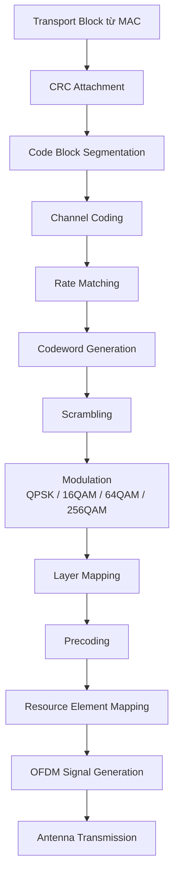

Điểm cần chú ý là layer mapping nằm **sau modulation** và **trước precoding**. Nghĩa là đầu vào của layer mapping không còn là bit thô nữa, mà là các symbol phức sau điều chế. Các symbol này có thể là QPSK, 16QAM, 64QAM hoặc 256QAM.

Ví dụ sau modulation, codeword 0 có thể tạo ra chuỗi symbol:

```text id="72tt5c"
d(0)(0), d(0)(1), d(0)(2), d(0)(3), ...
```

Nếu có codeword 1, ta có thêm:

```text id="cviyv1"
d(1)(0), d(1)(1), d(1)(2), d(1)(3), ...
```

Trong đó:

```text id="xrapfn"
d(q)(i)
```

là modulation symbol thứ `i` của codeword `q`.

Sau layer mapping, các symbol này được chuyển thành:

```text id="9tbtv0"
x(0)(i), x(1)(i), ..., x(υ-1)(i)
```

Trong đó:

```text id="xufjja"
x(l)(i)
```

là symbol thứ `i` trên layer `l`, còn `υ` là số layer.

Có thể hình dung đơn giản như sau:

```text id="j5o8md"
Trước layer mapping:

Codeword symbols:
d(0), d(1)

Sau layer mapping:

Layer symbols:
x(0), x(1), x(2), ...
```

Hình tiếp theo mô tả rõ hơn sự khác biệt giữa codeword, layer và antenna port.

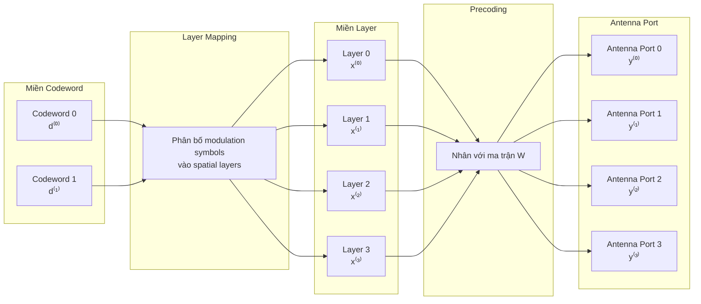

Điều quan trọng nhất trong hình trên là: **layer mapping không đưa dữ liệu ra antenna port**. Nó chỉ đưa dữ liệu vào các layer. Sau đó **precoding** mới biến các layer thành tín hiệu trên antenna port.

Ta có thể nhớ bằng ba miền xử lý:

```text id="wkejun"
Codeword domain → Layer domain → Antenna-port domain
```

Hoặc viết theo dạng tín hiệu:

```text id="74xh8k"
d(q)(i)  →  x(l)(i)  →  y(p)(i)
```

Trong đó:

```text id="l2wfev"
d(q)(i): symbol của codeword q
x(l)(i): symbol của layer l
y(p)(i): symbol trên antenna port p
```

Bây giờ xét một trường hợp đơn giản nhất: LTE chỉ truyền một layer. Khi chỉ có một layer, layer mapping gần như là truyền thẳng symbol từ codeword vào layer.

Nếu codeword 0 là:

```text id="k5ypf4"
d(0) = [a0, a1, a2, a3, a4, a5]
```

và số layer là 1, thì:

```text id="kav69q"
x(0) = [a0, a1, a2, a3, a4, a5]
```

Công thức:

```text id="ogjyqk"
x(0)(i) = d(0)(i)
```

Hình minh họa:

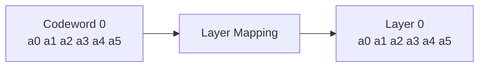

Trong trường hợp này, layer mapping chưa thể hiện rõ vai trò của nó, vì dữ liệu chỉ đi vào một layer duy nhất. Vai trò của layer mapping trở nên rõ hơn khi LTE dùng MIMO spatial multiplexing.

Giả sử LTE muốn truyền rank 2, tức là truyền 2 spatial layers. Khi đó, dữ liệu cần được chia thành hai layer để tại mỗi thời điểm xử lý, precoder nhận được một vector gồm 2 symbol.

Giả sử sau modulation, codeword 0 có 8 symbol:

```text id="718msp"
d(0) = [a0, a1, a2, a3, a4, a5, a6, a7]
```

Nếu một codeword được mapping lên 2 layer, cách chia là xen kẽ:

```text id="fvkf82"
Layer 0 = [a0, a2, a4, a6]
Layer 1 = [a1, a3, a5, a7]
```

Công thức:

```text id="66jqzk"
x(0)(i) = d(0)(2i)
x(1)(i) = d(0)(2i + 1)
```

Hình vẽ:

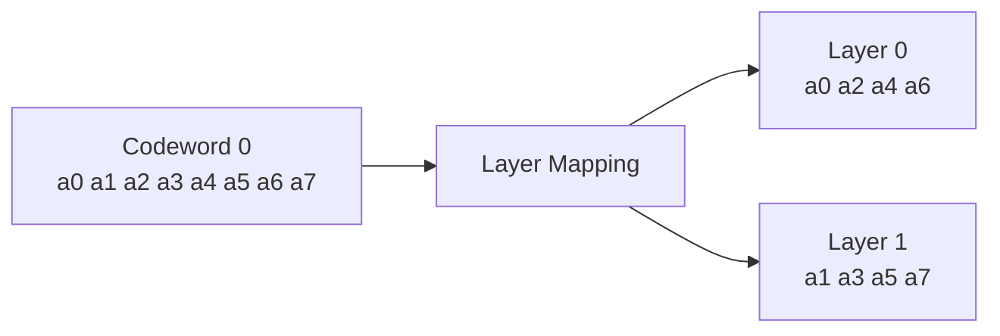

Nếu chỉ nhìn bên ngoài, ta có thể nói symbol chẵn đi vào layer 0, symbol lẻ đi vào layer 1. Nhưng cách hiểu sâu hơn là: **layer mapping đang tạo vector layer cho precoder**.

Ở thời điểm index `i = 0`, precoder không xử lý riêng `a0` hoặc riêng `a1`. Nó nhận vector:

```text id="5yx1ga"
x(0) = [a0, a1]T
```

Ở thời điểm index `i = 1`, nó nhận:

```text id="vb6ws6"
x(1) = [a2, a3]T
```

Ở thời điểm index `i = 2`, nó nhận:

```text id="7dlhwq"
x(2) = [a4, a5]T
```

Có thể hình dung như sau:

```text id="rv7ikx"
Layer 0:   a0     a2     a4     a6
Layer 1:   a1     a3     a5     a7
           │      │      │      │
           ▼      ▼      ▼      ▼
Vector:  [a0]   [a2]   [a4]   [a6]
         [a1]   [a3]   [a5]   [a7]
          i=0    i=1    i=2    i=3
```

Đây là bản chất thật sự của layer mapping. Nó không chỉ “chia đôi chuỗi symbol”. Nó sắp xếp symbol sao cho tại mỗi index `i`, hệ thống có được một vector layer:

```text id="bcrh56"
x(i) = [x(0)(i), x(1)(i), ..., x(υ-1)(i)]T
```

Vector này là đầu vào của precoder.

Sau layer mapping, precoding sẽ nhân vector layer với ma trận precoding `W`.

Ví dụ với 2 layer và 2 antenna port:

```text id="x3msil"
[y(0)(i)]   [w00  w01] [x(0)(i)]
[y(1)(i)] = [w10  w11] [x(1)(i)]
```

Hình minh họa quá trình này:

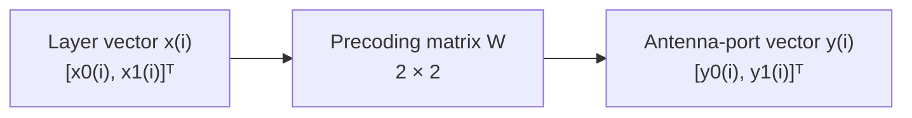

Nếu có 4 antenna ports nhưng chỉ truyền 2 layers, ma trận precoding sẽ có kích thước 4 × 2:

```text id="gvo21e"
[y0]       [x0]
[y1]       [x1]
[y2] = W ×
[y3]
```

Hay viết đầy đủ hơn:

```text id="vfdqd7"
[y(0)(i)]   [w00  w01] [x(0)(i)]
[y(1)(i)]   [w10  w11] [x(1)(i)]
[y(2)(i)] = [w20  w21]
[y(3)(i)]   [w30  w31]
```

Điều này cho thấy số layer không nhất thiết bằng số antenna port. Có thể có 2 layer nhưng 4 antenna ports. Khi đó nhiều antenna ports có thể được dùng để tạo beamforming hoặc tăng chất lượng truyền, thay vì tăng số luồng dữ liệu độc lập.

Hình dưới đây thể hiện rõ trường hợp 2 layer được precoding lên 4 antenna ports:

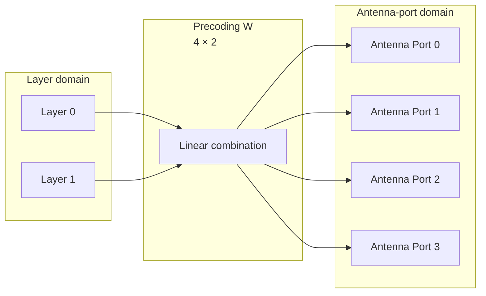

Vì vậy, có ba khái niệm phải tách biệt:

```text id="9jrxz7"
Codeword: dữ liệu đã được mã hóa và điều chế.

Layer: luồng dữ liệu không gian dùng cho MIMO.

Antenna port: cổng phát logic sau precoding.
```

Nếu gộp ba khái niệm này lại, ta sẽ rất dễ hiểu sai MIMO trong LTE.

Một điểm khác cũng rất quan trọng: **số codeword không nhất thiết bằng số layer**. LTE downlink spatial multiplexing thường có tối đa 2 codeword, nhưng số layer có thể lớn hơn 2. Vì vậy mới có các trường hợp như:

```text id="rhq61f"
1 codeword  → 1 layer
1 codeword  → 2 layers
2 codewords → 2 layers
2 codewords → 3 layers
2 codewords → 4 layers
```

Trường hợp 2 codeword mapping lên 2 layer là trường hợp dễ hiểu nhất.

Giả sử:

```text id="pz0hsz"
Codeword 0:
d(0) = [a0, a1, a2, a3]

Codeword 1:
d(1) = [b0, b1, b2, b3]
```

Layer mapping:

```text id="bvjd5x"
Layer 0 = [a0, a1, a2, a3]
Layer 1 = [b0, b1, b2, b3]
```

Hình minh họa:

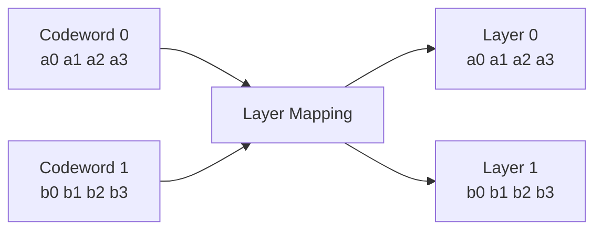

Tại từng index, vector layer là:

```text id="prj0bw"
i = 0: [a0, b0]T
i = 1: [a1, b1]T
i = 2: [a2, b2]T
i = 3: [a3, b3]T
```

Còn nếu 2 codeword mapping lên 4 layer, mỗi codeword sẽ được chia lên 2 layer.

Giả sử:

```text id="3uwq2k"
Codeword 0:
d(0) = [a0, a1, a2, a3, a4, a5, a6, a7]

Codeword 1:
d(1) = [b0, b1, b2, b3, b4, b5, b6, b7]
```

Layer mapping:

```text id="5k10g8"
Layer 0 = [a0, a2, a4, a6]
Layer 1 = [a1, a3, a5, a7]

Layer 2 = [b0, b2, b4, b6]
Layer 3 = [b1, b3, b5, b7]
```

Hình vẽ:

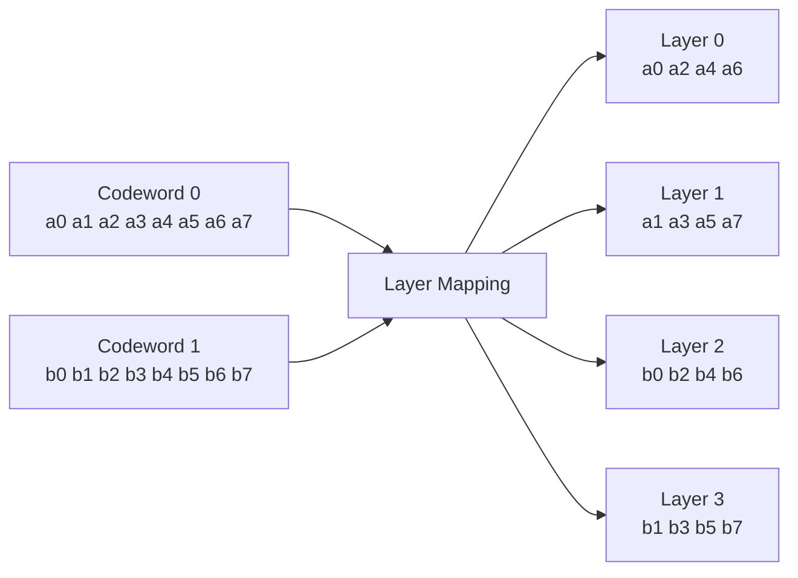

Tại `i = 0`, precoder nhận:

```text id="4klud0"
[a0, a1, b0, b1]T
```

Tại `i = 1`, precoder nhận:

```text id="351k49"
[a2, a3, b2, b3]T
```

Tại `i = 2`, precoder nhận:

```text id="pr8nbw"
[a4, a5, b4, b5]T
```

Hình sau mô tả rõ việc layer mapping tạo vector đầu vào cho precoder trong trường hợp 4 layers:

```text id="gz589h"
Layer 0:    a0      a2      a4      a6
Layer 1:    a1      a3      a5      a7
Layer 2:    b0      b2      b4      b6
Layer 3:    b1      b3      b5      b7
            │       │       │       │
            ▼       ▼       ▼       ▼
Vector:   [a0]    [a2]    [a4]    [a6]
          [a1]    [a3]    [a5]    [a7]
          [b0]    [b2]    [b4]    [b6]
          [b1]    [b3]    [b5]    [b7]
           i=0     i=1     i=2     i=3
```

Lúc này precoding sẽ dùng ma trận `W` để biến vector 4 layer thành vector antenna port.

Nếu có 4 layer và 4 antenna ports:

```text id="aish6h"
y(i) = W × x(i)
```

Trong đó:

```text id="2xgl5h"
x(i): vector layer kích thước 4 × 1
W: ma trận precoding kích thước 4 × 4
y(i): vector antenna port kích thước 4 × 1
```

Hình minh họa:

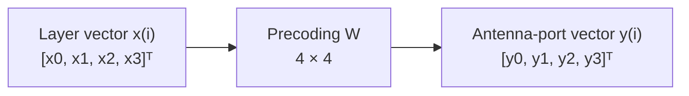

Nếu nhìn theo mô hình truyền MIMO, tín hiệu UE nhận được có thể hình dung như:

```text id="6b1bpb"
r = H × W × x + n
```

Trong đó:

```text id="g35rr9"
x: vector layer sau layer mapping
W: ma trận precoding
H: ma trận kênh vô tuyến
n: nhiễu
r: tín hiệu UE nhận được
```

Hình mô hình MIMO đầy đủ:

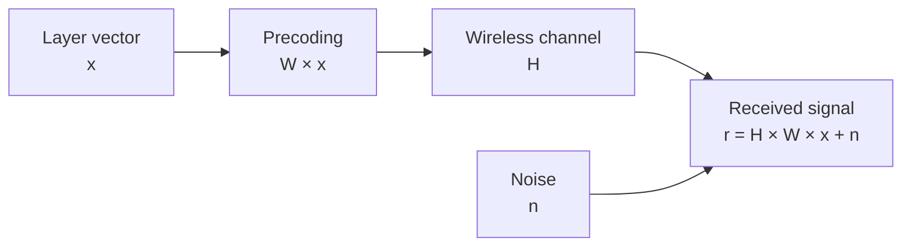

Từ mô hình này có thể thấy layer mapping tạo ra `x`. Nếu `x` sai, toàn bộ phía sau dù tính toán đúng vẫn xử lý sai dữ liệu. Precoder có thể nhân ma trận đúng, resource mapping có thể đúng, OFDM có thể đúng, nhưng UE sẽ nhận tín hiệu không khớp với giả định giải mã.

Đây là lý do trong implement LTE PHY, layer mapping tuy nhìn đơn giản nhưng rất quan trọng. Nó là bước tổ chức buffer giữa modulation và precoding. Nếu mapping lệch index, đảo layer, hoặc sai số symbol trên mỗi layer, lỗi có thể xuất hiện dưới dạng BLER cao, HARQ NACK nhiều, hoặc UE không decode được PDSCH.

Về mặt implement, nếu một codeword được chia lên `L` layer, mapping có thể hiểu bằng phép modulo.

Giả sử codeword có chuỗi symbol:

```text id="8fon8y"
d[0], d[1], d[2], ..., d[M-1]
```

Nếu mapping lên `L` layer:

```text id="4r64ny"
layer = symbol_index mod L
position_in_layer = floor(symbol_index / L)
```

Ví dụ mapping lên 4 layer, symbol `d[10]` sẽ đi vào:

```text id="mb2va3"
layer = 10 mod 4 = 2
position_in_layer = floor(10 / 4) = 2
```

Nghĩa là:

```text id="pvgomi"
d[10] → Layer 2, vị trí index 2
```

Pseudo-code:

```c id="vt9mgz"
for (int i = 0; i < M / num_layers; i++) {
    for (int l = 0; l < num_layers; l++) {
        x[l][i] = d[num_layers * i + l];
    }
}
```

Hình vẽ cách mapping theo modulo cho 4 layer:

```text id="vtmlyh"
Input symbol index:

d0   d1   d2   d3   d4   d5   d6   d7   d8   d9   d10  d11
│    │    │    │    │    │    │    │    │    │    │    │
▼    ▼    ▼    ▼    ▼    ▼    ▼    ▼    ▼    ▼    ▼    ▼
L0   L1   L2   L3   L0   L1   L2   L3   L0   L1   L2   L3

Output layers:

Layer 0: d0   d4   d8
Layer 1: d1   d5   d9
Layer 2: d2   d6   d10
Layer 3: d3   d7   d11
```

Một điểm cần nhớ là layer mapping **không làm thay đổi giá trị symbol**. Nó không nhân hệ số, không xoay pha, không cộng trộn symbol. Nó chỉ phân bố lại symbol vào các layer.

Vì vậy:

```text id="5xqok6"
Layer mapping:
reorder / distribute symbols

Precoding:
linear combination / spatial weighting
```

Nếu sau layer mapping mà symbol bị thay đổi giá trị, có thể bạn đang xem nhầm buffer sau precoding hoặc sau một bước xử lý khác.

Cũng cần phân biệt spatial multiplexing và transmit diversity.

Trong spatial multiplexing, mục tiêu là tăng throughput bằng cách truyền nhiều layer độc lập song song. Khi điều kiện kênh tốt, UE có thể tách được nhiều layer, eNodeB có thể truyền rank cao hơn.

Trong transmit diversity, mục tiêu là tăng độ tin cậy truyền dẫn. Dữ liệu có thể được xử lý qua nhiều antenna port theo cách tạo diversity, nhưng không phải để tạo nhiều luồng dữ liệu độc lập như spatial multiplexing.

Hình so sánh:

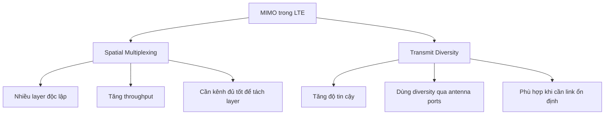

Trong LTE, UE thường báo về các thông tin như RI, PMI và CQI.

```text id="e3q81o"
RI  = Rank Indicator
PMI = Precoding Matrix Indicator
CQI = Channel Quality Indicator
```

RI liên quan trực tiếp đến số layer mà UE nghĩ là phù hợp với điều kiện kênh hiện tại.

Ví dụ:

```text id="w0zgy5"
RI = 1 → nên truyền 1 layer
RI = 2 → có thể truyền 2 layer
RI = 4 → có thể truyền 4 layer
```

Nhưng eNodeB không chỉ dựa vào RI. Scheduler còn phải xét thêm MCS, HARQ, tải cell, capability của UE, số antenna port, transmission mode và chính sách scheduling.

Có thể hình dung quan hệ giữa channel condition và số layer như sau:

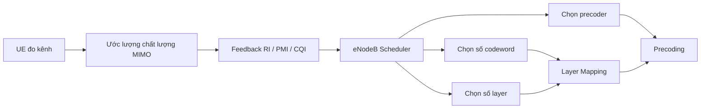

Nếu kênh tốt và các đường không gian đủ độc lập, rank cao có thể giúp tăng throughput. Nếu kênh xấu hoặc tương quan anten cao, dùng nhiều layer có thể làm UE khó tách tín hiệu, dẫn đến BLER tăng. Vì vậy layer mapping không thể tách rời khỏi toàn bộ quyết định MIMO của scheduler.

Khi debug hoặc implement, có bốn câu hỏi rất quan trọng:

```text id="k39oio"
1. Hiện tại dữ liệu đang ở miền codeword hay miền layer?

2. Có bao nhiêu codeword?

3. Có bao nhiêu layer?

4. Mỗi codeword được mapping vào những layer nào?
```

Nếu trả lời được bốn câu hỏi này, ta sẽ tránh được phần lớn nhầm lẫn khi đọc log PHY hoặc check buffer.

Ví dụ trong log có thể bạn thấy:

```text id="11z5r4"
num_codewords = 2
num_layers = 4
mod_order_cw0 = 6
mod_order_cw1 = 6
```

Không nên hiểu là codeword 0 vào layer 0 và codeword 1 vào layer 1 rồi bỏ qua layer 2, 3. Với 4 layer, cách hiểu hợp lý là:

```text id="q0n191"
Codeword 0 → Layer 0, Layer 1
Codeword 1 → Layer 2, Layer 3
```

Nếu codeword 0 có 1200 modulation symbols và được chia lên 2 layer, mỗi layer nhận 600 symbols. Nếu codeword 1 cũng có 1200 modulation symbols và được chia lên 2 layer, layer 2 và layer 3 cũng mỗi layer nhận 600 symbols.

Hình buffer trong trường hợp này:

```text id="ynxzi4"
Codeword 0 buffer:
a0 a1 a2 a3 ... a1198 a1199

Codeword 1 buffer:
b0 b1 b2 b3 ... b1198 b1199

Sau layer mapping:

Layer 0:
a0 a2 a4 ... a1198

Layer 1:
a1 a3 a5 ... a1199

Layer 2:
b0 b2 b4 ... b1198

Layer 3:
b1 b3 b5 ... b1199
```

Nếu debug thấy layer 0 nhận toàn bộ codeword 0 còn layer 1 trống, hoặc layer 2 nhận nhầm symbol của codeword 0, thì khả năng cao lỗi nằm ở phần layer mapping hoặc phần tính toán số layer/codeword trước đó.

Tóm lại, layer mapping trong LTE cần được hiểu như một bước chuyển đổi miền dữ liệu.

Trước layer mapping, dữ liệu nằm ở dạng:

```text id="5nbbet"
Codeword symbols d(q)
```

Sau layer mapping, dữ liệu nằm ở dạng:

```text id="htbjz5"
Layer symbols x(l)
```

Sau precoding, dữ liệu trở thành:

```text id="q87x8w"
Antenna-port symbols y(p)
```

Hình tổng kết:

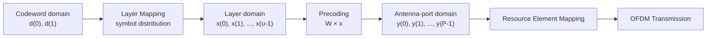

Câu kết luận quan trọng nhất là:

```text id="2b0iaq"
Layer mapping không phải beamforming.
Layer mapping không phải antenna mapping.
Layer mapping không phải channel coding.

Layer mapping là bước sắp xếp modulation symbols từ codeword vào spatial layers để chuẩn bị cho precoding.
```

Nếu hiểu đúng câu này, bạn sẽ thấy LTE MIMO trở nên mạch lạc hơn nhiều: codeword phục vụ xử lý mã hóa dữ liệu, layer phục vụ truyền dẫn không gian, precoding phục vụ ánh xạ layer ra antenna ports, còn resource element mapping đưa tín hiệu đã precoded vào lưới thời gian-tần số để phát OFDM.
